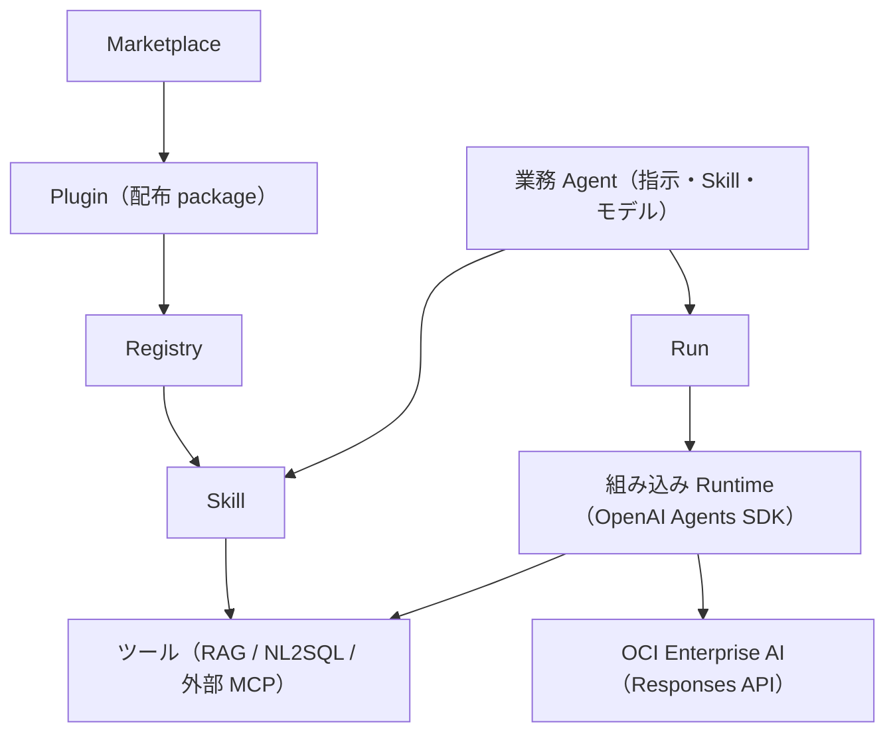

# Agent Platform 設計

## 1. Positioning

業務・業界の Agent を作り、Skill と MCP（RAG・NL2SQL・その他）を安全に使わせる製品。業務 Agent の定義と、
その実行（組み込み Runtime）、共通の Run・Event・Artifact・Approval・Audit を 1 つの製品で持つ。

#754 で、外部の Runtime（OpenClaw / Hermes / DeerFlow）への Binding による配置をやめ、Control Plane の中の
組み込み Runtime（OpenAI Agents SDK + OCI Enterprise AI の Responses API）で実行する形にした。
今後の作り変えは「Agent Platform 再設計案」（2026-10-02）に沿う。



## 2. Domain contracts

### Business Agent

`AgentProfile` の正式な編集対象は `name / description / instructions / skill_ids / model_id / enabled`。
Plugin、MCP、Tool、Runtime を Agent に埋め込まない。`tool_names` は移行リリースの読取互換だけである
（`command_allowed_prefixes` は #756 で削除した）。

### Skill

Skill は AgentSkills 互換の指示本体であり、次の内部依存を持つ。

```json
{
  "id": "business_rag_research",
  "instructions": "...",
  "mcp_requirements": [
    {"server_id": "control-plane", "tool_names": ["external_rag_search"]}
  ],
  "resource_ids": []
}
```

組み込み Runtime は、Agent の選択 Skill が要求するツールの和集合だけをモデルに渡す（指示への列挙だけで
権限を表現せず、渡すツールの一覧を実体として絞る）。

### Marketplace package

正式 manifest は `skills[] / mcp_servers[] / resources[]`。resource kind は `prompt / workflow /
template` で、初期実装は inline JSON/text のみ。resource を実行しない。

Install は事前に Skill/MCP/resource の重複と参照を検証し、衝突時に package 全体を拒否する。
旧 `agents[]` は Agent を作らず template resource に変換して warning を返す。参照中 Skill を持つ
package の disable/uninstall は `409`。

### 組み込み Runtime（#754）

- `features/agent/builtin_runtime.py`。SDK は `openai-agents`（`pyproject.toml` で版を固定）。
- モデル: Agent の `model_id`（空なら「システム設定 > モデル」の既定のテキストモデル）と、その接続（Endpoint・API key・
  Project OCID）。`OpenAIResponsesModel` に OCI の OpenAI 互換の base URL を渡す。xAI のモデルは空の `tools` を
  拒否するため、ツールが無い呼び出しでは `tools` / `tool_choice` を送らない（`OciResponsesModel`）。
- 指示: 共通の前置き（日本語・根拠・推測しない）＋ Agent の指示 ＋ 割り当てた Skill の指示。
- ツール: Skill の requirement（`server_id="control-plane"`）が要求する `tool_registry` のツールを `FunctionTool` にする。
  実行は `tool_registry.invoke`（ポリシー・ガードレール・監査・成果物、RAG / NL2SQL のサービストークン）。
  ポリシーの「拒否」は渡さず、「承認」は `needs_approval=True`。
- 承認: SDK の中断（`result.interruptions`）で承認待ちの step と ApprovalRequest を作り、`result.to_state().to_string()`
  を Run の metadata（`_builtin_sdk_state`）に保存して `waiting_approval` にする。すべて決まると `queued` に戻り、
  状態を復元して承認・却下を反映し再開する。承認済みのツールは中断時の step を実行中にして結果を記録する。
- tracing: `set_tracing_disabled(True)`（業務データを外部へ送らない）。
- テスト: SDK の `agents.testing.ScriptedModel` でモデルを台本にする（`tests/test_builtin_runtime.py`）。

### RunState

共通 Run は状態/Event/Artifact/Approval/Audit と `runtime_id`（新しい Run は `builtin`）を持つ。
`POST /api/runs` は `agent_id` と `goal` だけを受け取り、組み込み Runtime で実行する。モデルの最終回答は
`kind="answer"` の Artifact に残す。

## 3. ツールとポリシー

RAG / NL2SQL / 外部 MCP のツールは `tool_registry` に登録し、組み込み Runtime からだけ呼ぶ。schema 検証、ToolPolicy、
PII/secret masking、audit metadata、成果物の保存を再利用する。外部 Runtime 向けの Binding MCP（`/api/mcp/{binding_id}`）
と adapter 契約（`probe_capabilities / sync_binding / submit_run / ...`）は #754 で削除した。

## 4. 製品の MCP

### 4.1 RAG / NL2SQL の MCP（#233）

業務 RAG / NL2SQL は各製品の `POST /api/mcp`（MCP の Streamable HTTP、JSON 応答）を呼ぶ。runtime には直接
見せず、Control Plane のツール（`external_rag_*` / `external_nl2sql_*`）として schema 検証・ToolPolicy・
masking・監査を通す。契約は各製品のツール（#230〜#232）をそのまま通す。

| Agent のツール | 呼び先のツール | permission level | 備考 |
|---|---|---|---|
| `external_rag_search` | `rag_search` | READ | 回答生成に LLM を使う |
| `external_rag_chat` | `rag_chat_send_message` | WRITE（side effects あり） | RAG に会話を作成・追記する。既定の policy で承認が必要 |
| `external_rag_list_business_views` | `rag_list_business_views` | READ | 利用者が RAG で使える業務ビューの一覧 |
| `external_nl2sql_query` | `nl2sql_query` | SENSITIVE | 業務 DB へ SQL を実行する。既定の policy で承認が必要。`row_limit` を省略すると `AGENT_EXTERNAL_NL2SQL_DEFAULT_LIMIT`（1〜1000 に丸める） |
| `external_nl2sql_get_job` | `nl2sql_get_job` | READ | 待ち時間内に終わらなかったジョブの続き（本人のジョブだけ） |

- **利用者**: Run の作成時に、ログイン中の利用者（Cookie のセッション。local mode ではローカル利用者）の
  `user_uuid` を `RunState.created_by_user_uuid` に記録する（checkpoint の JSON に入る。項目がない既存の Run は
  None）。Run からのツール呼び出し
  （承認後の再実行を含む）は `ToolInvocationContext.user_uuid` / `run_id` にこの値を入れるため、承認者ではなく
  Run を作った利用者として呼ぶ。再実行（replay）の Run は、再実行を指示した利用者になる。単発の
  `POST /tools/invoke` は呼び出したログイン中の利用者として呼ぶ。
- **token**: 呼び出しごとに `issue_service_token(PLATFORM_SERVICE_TOKEN_SECRET, subject=<Run の利用者 or
  サービス利用者>, audience="rag"|"nl2sql", issuer="agent", claims={"run_id", "agent_id"})`（HS256、60 秒）を
  作り、`Authorization: Bearer` で送る。署名鍵は 3 製品の共通 `.env` で同じ値にする（32 文字以上。未設定なら
  `*.service_token_not_configured`）。サービス利用者の login ID → `user_uuid` は共通認証の store で解決し、
  プロセス内にキャッシュする。
- **MCP の手順**: 呼び出しごとに `initialize`（`2025-06-18`）→ `notifications/initialized` → `tools/call`。
  応答の `Mcp-Session-Id` を以降の request に付け、`Accept: application/json, text/event-stream` と
  `MCP-Protocol-Version` を送る。結果は `structuredContent`、`isError: true` は `*.tool_error`（呼び先の
  `error_code` / `message` / `status` を `error_details` に入れる）。SSE の途中経過と paging は扱わない。
  外部 MCP gateway（`AGENT_EXTERNAL_MCP_*`）も同じ client を使う。固定の session id を設定した gateway には
  `initialize` を送らず、`initialize` を持たない gateway（`-32601`）はそのまま `tools/*` を呼ぶ。
- **再試行**: LLM を使う・書き込むツール（`rag_search` / `rag_chat_send_message` / `nl2sql_query`）は、
  502 / 504・timeout で再試行しない（処理が進んでいる可能性があり、重複させない）。429 / 503 と接続失敗だけ
  `AGENT_EXTERNAL_*_MAX_RETRIES` 回まで再試行する。読み取りだけのツールは従来どおり 429 / 5xx・timeout も再試行する。
- **設定**: `AGENT_EXTERNAL_RAG_MCP_URL` / `AGENT_EXTERNAL_NL2SQL_MCP_URL`（例 `http://rag-host/api/mcp`）、
  `AGENT_EXTERNAL_*_TIMEOUT_SECONDS`（既定 60 秒）。画面の「外部 RAG」「外部 NL2SQL」では URL・タイムアウト・
  既定取得件数を変更でき、署名鍵とサービス利用者は設定済みかどうかだけを表示する。旧名
  （`AGENT_EXTERNAL_RAG_BASE_URL` / `AGENT_EXTERNAL_RAG_API_KEY` と NL2SQL の同等）は読まない。

## 5. Dispatcher and persistence

開発時は API のプロセスで実行する（`AGENT_RUNTIME_DISPATCH_MODE=in_process`。asyncio の task）。本番で別プロセスに
する場合は `runtime-dispatcher`（`python -m app.features.agent.runtime_dispatcher`）が Oracle checkpoint row を
`SELECT ... FOR UPDATE` し、queued の組み込み Runtime の Run に期限付き lease を付けて claim し、実行・再開する。
実行を始めたら lease を外す（承認の決定で queued に戻った Run を、すぐ claim できるようにする）。別 queue 製品は追加しない。

外部 dispatcher は `AGENT_RUNTIME_REPOSITORY_BACKEND=oracle_checkpoint|oracle_normalized` が前提。
memory backend は process 間共有されないため production dispatcher に使用しない。

## 7. Snapshot migration

Snapshot v2 は runs/agents を持つ（旧版の `control_plane_state.runtimes/bindings`（#754）と `memory`（#756）は読み込んでも使わない）。

- v1 tool を一意に対応できる Skill へ推定。
- 変換不能 tool があれば `migration_required=true`, `enabled=false`。
- 既存 Run は model default により `runtime_id=legacy-native`。
- 旧エンジンの Memory・v1 Run（`X-Agent-API-Version: 1`）・planner は #756 で削除した。

## 8. UI information architecture

主要ナビは「業務 Agent / Skill / Runtime / Run / 承認・監査 / Marketplace」。Agent 画面では指示・Skill・モデルを選ぶ。
Run は Agent とゴールだけを受け取る（実行先の選択は無い）。Runtime 画面は組み込み Runtime の状態（SDK の版・既定のモデル・
選べるモデル・実行できるか）と、モデル未設定のときの理由と「システム設定 > モデル」への導線を出す。

## 9. Authentication and RBAC

画面は RAG / NL2SQL と同じ共通認証（`PLATFORM_*` のユーザー・ロール・セッション）でログインする。ロールに付ける
Agent の権限（`AGENT_ROLE_PERMISSIONS`）と対象範囲（`AGENT_ROLE_AGENTS`）は
システムテーブル（`app.system_schema`。#751）が作る。capability は従来の viewer / operator / approver / auditor / admin に対応し、
利用者（Cookie のセッション、local はローカル利用者）から `ActorPolicy` を作って Run・監査・承認・成果物・SSE・WebSocket・
`GET /agents` の絞り込みに流す。Cookie のないリクエストは 401（#750 で header / JWT / 外部 policy の認可を削除した）。
業務ビューの判定は RAG が Run の利用者のサービストークンで行うため、Agent は業務ビューの対象範囲を持たない（#750）。
詳細は [security-rbac.md](security-rbac.md)。

## 10. Non-goals

- 外部の Agent Runtime（OpenClaw / Hermes / DeerFlow など）への配置と adapter（#754 で削除）
- 独立した planner / workflow engine
- 外部 archive の Marketplace install
