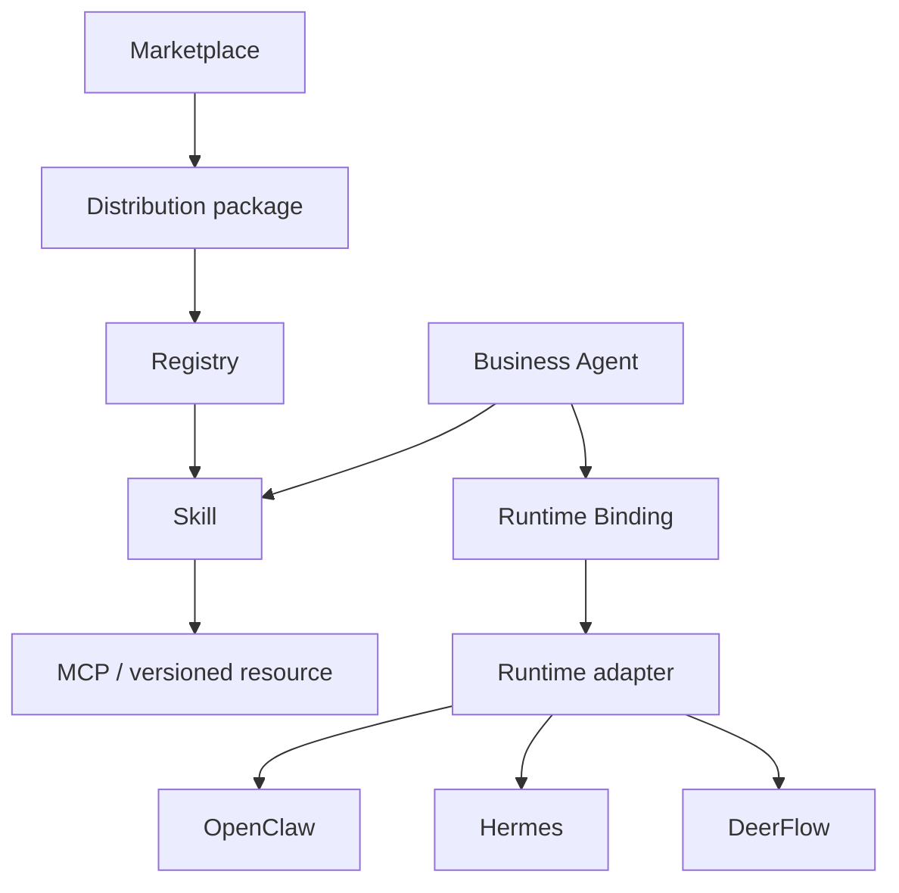

# AI Agent Control Plane 設計

## 1. Positioning

> **Production Control Plane for AI Agents**
> **Define Business Agents once. Execute them anywhere.**

Control Plane は Agent の業務定義を Runtime 実装から分離し、同じ Business Agent を OpenClaw、
Hermes、DeerFlow、将来の Runtime へ明示 Binding で配置する。Runtime の自動切替は行わず、
どの定義をどこで実行したかを常に監査できることを優先する。



## 2. Domain contracts

### Business Agent

`AgentProfile` の正式な編集対象は `name / description / instructions / skill_ids / enabled`。
Plugin、MCP、Tool、Runtime、command policy を Agent に埋め込まない。`tool_names` と
`command_allowed_prefixes` は移行リリースの読取互換だけである。

### Skill

Skill は AgentSkills 互換の指示本体であり、次の内部依存を持つ。

```json
{
  "id": "business_rag_research",
  "instructions": "...",
  "mcp_requirements": [
    {"server_id": "control-plane", "tool_names": ["external_rag_search"]}
  ],
  "resource_ids": []
}
```

Binding 同期は選択 Skill の和集合だけを materialize する。Runtime prompt への列挙だけで権限を
表現せず、Skill allowlist と Binding MCP tool allowlist を実体として生成する。

### Marketplace package

正式 manifest は `skills[] / mcp_servers[] / resources[]`。resource kind は `prompt / workflow /
template` で、初期実装は inline JSON/text のみ。resource を実行しない。

Install は事前に Skill/MCP/resource の重複と参照を検証し、衝突時に package 全体を拒否する。
旧 `agents[]` は Agent を作らず template resource に変換して warning を返す。参照中 Skill を持つ
package の disable/uninstall は `409`。

### RuntimeDefinition

Runtime は kind、接続先、secret env ref、managed service、capabilities、状態を持つ。secret 値は
永続化しない。`legacy-native` は built-in read-only RuntimeDefinition として既存 Run に付与する。

### RuntimeBinding

Binding は `agent_id / runtime_id / native_agent_ref / is_default / enabled / policy / sync_status` を
持つ。Agent ごとの既定は最大1件。同一 Runtime の `native_agent_ref` も一意。Agent 削除時は
Binding と materialization を削除する。

### RunState

共通 Run は従来の状態/Event/Artifact/Audit に次を追加する。

- `runtime_id`
- `binding_id`
- `external_run_id`
- `external_cursor`
- submit 時点の `runtime_capabilities`

`POST /api/runs` は明示 Binding、Agent 既定 Binding の順に解決する。未 Binding、同期未完、
Runtime disabled は `409`。外部 submit 後も Binding と capability snapshot は変えない。

## 3. Adapter boundary

```python
class RuntimeAdapter(Protocol):
    probe_capabilities(...)
    sync_binding(...)
    submit_run(...)
    follow_events(...)
    get_status(...)
    cancel(...)
    list_artifacts(...)
```

- OpenClaw: Gateway WebSocket protocol v3–4、`chat.send`、`agent.wait`、`sessions.abort`、
  `artifacts.list`。内部 control-plane client として最小 scope で handshake する。
- Hermes: `/v1/capabilities`、`/v1/runs`、SSE events、status、stop。
- DeerFlow: `/api/langgraph/threads` と run/state、thread state の artifacts。

Runtime が対応しない操作はローカル成功に置き換えず、
`409 runtime_capability_unsupported` を返し UI に理由を表示する。

## 4. Binding MCP

`/api/mcp/{binding_id}` は MCP initialize / tools/list / tools/call の最小 surface を提供する。
公開 tool は Agent の選択 Skill が要求する `server_id=control-plane` の閉包だけ。そのうち ToolPolicy で承認なしに実行できる（`allow`）tool だけを公開する。Binding MCP の呼び出しは Run と結びつかず承認の記録を作れないため、承認が必要（`ask`）・拒否（`deny`）の tool（例: 既定 policy の `external_nl2sql_query`・`external_rag_chat`）は `tools/list` に出さず、呼ぶと `-32601` で拒否する（#244）。tool 実行は既存の
Pydantic input schema、ToolPolicy、PII/secret masking、audit metadata を再利用する。

認証 token は次の順で解決する。

1. `AGENT_BINDING_MCP_TOKEN_<NORMALIZED_BINDING_ID>`（Binding ID の英数字以外を `_` にして大文字化）
2. `AGENT_CONTROL_PLANE_MCP_TOKEN_SECRET` から HMAC-SHA256 派生

Runtime へ同期する MCP server 定義の `api_key_env` にも 1 の名前を渡す。
#211 で旧名 `CONTROL_PLANE_MCP_TOKEN_<ID>` は読まなくなった。

token が無い場合は fail closed (`503`)。値を Binding JSON、snapshot、API に保存しない。

Binding MCP endpoint は Runtime からの呼出し境界のため、production（`AGENT_AUTH_MODE=production`）でも
Cookie のログインと権限 manifest の対象外で、この token だけで認証する（#215）。

Binding MCP の呼び出しは Run と結びつかない（Runtime は Run の ID を送らない）。そのため RAG / NL2SQL の
ツールは Run の利用者ではなく、サービス利用者（`AGENT_MCP_SERVICE_USER_LOGIN_ID`）として呼ぶ（§4.1）。
サービス利用者が未設定なら、そのツールは `external_rag.user_required` などで失敗する。RAG / NL2SQL で
できることはサービス利用者のロールの権限・対象範囲に限られるため、専用のユーザーを作り、必要な
業務ビュー・業務プロファイルだけを割り当てる。

### 4.1 RAG / NL2SQL の MCP（#233）

業務 RAG / NL2SQL は各製品の `POST /api/mcp`（MCP の Streamable HTTP、JSON 応答）を呼ぶ。runtime には直接
見せず、Control Plane のツール（`external_rag_*` / `external_nl2sql_*`）として schema 検証・ToolPolicy・
masking・監査を通す。契約は各製品のツール（#230〜#232）をそのまま通す。

| Agent のツール | 呼び先のツール | permission level | 備考 |
|---|---|---|---|
| `external_rag_search` | `rag_search` | READ | 回答生成に LLM を使う |
| `external_rag_chat` | `rag_chat_send_message` | WRITE（side effects あり） | RAG に会話を作成・追記する。既定の policy で承認が必要 |
| `external_rag_list_business_views` | `rag_list_business_views` | READ | 権限管理の業務ビューの候補にも使う |
| `external_nl2sql_query` | `nl2sql_query` | SENSITIVE | 業務 DB へ SQL を実行する。既定の policy で承認が必要。`row_limit` を省略すると `AGENT_EXTERNAL_NL2SQL_DEFAULT_LIMIT`（1〜1000 に丸める） |
| `external_nl2sql_get_job` | `nl2sql_get_job` | READ | 待ち時間内に終わらなかったジョブの続き（本人のジョブだけ） |

- **利用者**: Run の作成時に、ログイン中の利用者（Cookie のセッション。local mode ではローカル利用者）の
  `user_uuid` を `RunState.created_by_user_uuid` に記録する（checkpoint の JSON に入る。項目がない既存の Run は
  None）。外部連携（header / JWT / 外部 policy の RBAC）で作った Run は None。Run からのツール呼び出し
  （承認後の再実行を含む）は `ToolInvocationContext.user_uuid` / `run_id` にこの値を入れるため、承認者ではなく
  Run を作った利用者として呼ぶ。再実行（replay）の Run は、再実行を指示した利用者になる。単発の
  `POST /tools/invoke` は呼び出したログイン中の利用者として呼ぶ。
- **token**: 呼び出しごとに `issue_service_token(PLATFORM_SERVICE_TOKEN_SECRET, subject=<Run の利用者 or
  サービス利用者>, audience="rag"|"nl2sql", issuer="agent", claims={"run_id", "agent_id"})`（HS256、60 秒）を
  作り、`Authorization: Bearer` で送る。署名鍵は 3 製品の共通 `.env` で同じ値にする（32 文字以上。未設定なら
  `*.service_token_not_configured`）。サービス利用者の login ID → `user_uuid` は共通認証の store で解決し、
  プロセス内にキャッシュする。
- **MCP の手順**: 呼び出しごとに `initialize`（`2025-06-18`）→ `notifications/initialized` → `tools/call`。
  応答の `Mcp-Session-Id` を以降の request に付け、`Accept: application/json, text/event-stream` と
  `MCP-Protocol-Version` を送る。結果は `structuredContent`、`isError: true` は `*.tool_error`（呼び先の
  `error_code` / `message` / `status` を `error_details` に入れる）。SSE の途中経過と paging は扱わない。
  外部 MCP gateway（`AGENT_EXTERNAL_MCP_*`）も同じ client を使う。固定の session id を設定した gateway には
  `initialize` を送らず、`initialize` を持たない gateway（`-32601`）はそのまま `tools/*` を呼ぶ。
- **再試行**: LLM を使う・書き込むツール（`rag_search` / `rag_chat_send_message` / `nl2sql_query`）は、
  502 / 504・timeout で再試行しない（処理が進んでいる可能性があり、重複させない）。429 / 503 と接続失敗だけ
  `AGENT_EXTERNAL_*_MAX_RETRIES` 回まで再試行する。読み取りだけのツールは従来どおり 429 / 5xx・timeout も再試行する。
- **設定**: `AGENT_EXTERNAL_RAG_MCP_URL` / `AGENT_EXTERNAL_NL2SQL_MCP_URL`（例 `http://rag-host/api/mcp`）、
  `AGENT_EXTERNAL_*_TIMEOUT_SECONDS`（既定 60 秒）。画面の「外部 RAG」「外部 NL2SQL」では URL・タイムアウト・
  既定取得件数を変更でき、署名鍵とサービス利用者は設定済みかどうかだけを表示する。旧名
  （`AGENT_EXTERNAL_RAG_BASE_URL` / `AGENT_EXTERNAL_RAG_API_KEY` と NL2SQL の同等）は読まない。

## 5. Dispatcher and persistence

開発時は FastAPI BackgroundTasks で submit する。本番は `runtime-dispatcher` が Oracle checkpoint
row を `SELECT ... FOR UPDATE` し、queued Run に期限付き lease を付けて claim する。submit 成功または
失敗時に lease を除去して Event を保存する。これにより別 queue 製品を追加しない。

外部 dispatcher は `AGENT_RUNTIME_REPOSITORY_BACKEND=oracle_checkpoint|oracle_normalized` が前提。
memory backend は process 間共有されないため production dispatcher に使用しない。

## 6. Runtime services（第三者の構築済みイメージ）

Control Plane（backend・frontend）と runtime-dispatcher は自前のコードなので Docker を使わず、開発は `uv run`、
本番は systemd で動かす（#286 / #356）。`docker-compose.yml` は第三者の Runtime だけを opt-in profile で持つ。

| Profile | Service | State | Health |
|---|---|---|---|
| `openclaw` | `runtime-openclaw` | `openclaw-state/auth` | `/readyz` |
| `hermes` | `runtime-hermes` | `hermes-state` | `/health` |
| `deerflow` | `runtime-deerflow` | `deerflow-state` | `/api/models` |

外部 dispatcher（`AGENT_RUNTIME_DISPATCH_MODE=external`）は Oracle を使う別プロセス
（`python -m app.features.agent.runtime_dispatcher`）で、compose の service ではない。
各 Runtime は Control Plane の Binding の書き出し（`AGENT_RUNTIME_BINDINGS_DIR`）を読み取り専用で mount する。
Runtime image はすべて公式 registry の multi-arch digest を固定する。Docker socket は mount しない。
管理 API は `AGENT_RUNTIME_SERVICE_CONTROL_ENABLED=true` の管理者 host 運用でのみ有効。

## 7. Snapshot migration

Snapshot v2 は runs/agents/legacy memory に `control_plane_state.runtimes/bindings` を追加する。

- v1 tool を一意に対応できる Skill へ推定。
- 変換不能 tool があれば `migration_required=true`, `enabled=false`。
- command prefix は最初の Binding 作成時に `policy.command_allowed_prefixes` へ移す。
- 既存 Run は model default により `runtime_id=legacy-native`。
- Memory は export/search だけを維持し、手動新規書込は `410`。
- v1 Run は `X-Agent-API-Version: 1` 明示時のみ。deprecation/sunset header を返す。

## 8. UI information architecture

主要ナビは「業務 Agent / Skill / Runtime / Run / 承認・監査 / Marketplace」。Agent 画面では Skill
だけを選び、Agent 詳細の「実行先」panel で Binding を追加・同期する。Run は Agent と Binding 上書き
だけを受け取り、Tool/arguments は表示しない。

Runtime 画面は status、capabilities、enable、probe、管理可能な service action/log を表示する。
未 Binding、sync error、degraded、capability 非対応を warning/error state として表示する。

## 9. Authentication and RBAC

画面は RAG / NL2SQL と同じ共通認証（`PLATFORM_*` のユーザー・ロール・セッション）でログインする。ロールに付ける
Agent の権限（`AGENT_ROLE_PERMISSIONS`）と対象範囲（`AGENT_ROLE_AGENTS` / `AGENT_ROLE_BUSINESS_VIEWS`）は
`app.cli.agent_security_migrate` が作る。capability は従来の viewer / operator / approver / auditor / admin に対応し、
Cookie の利用者から `ActorPolicy` を作って Run・監査・承認・成果物・SSE・WebSocket・`GET /agents` の既存の絞り込みに流す。
Cookie のないリクエストは `AGENT_RBAC_ENABLED=true` のときだけ header / JWT / 外部 policy（外部連携）で判定する。
詳細は [security-rbac.md](security-rbac.md)。

## 10. Non-goals

- Control Plane 内の新しい Agent Runtime / planner / workflow engine
- Runtime 自動 failover
- 外部 archive の Marketplace install
- OKE / Container Instances driver
- 別 LLM provider、外部 vector DB、新規 queue product
