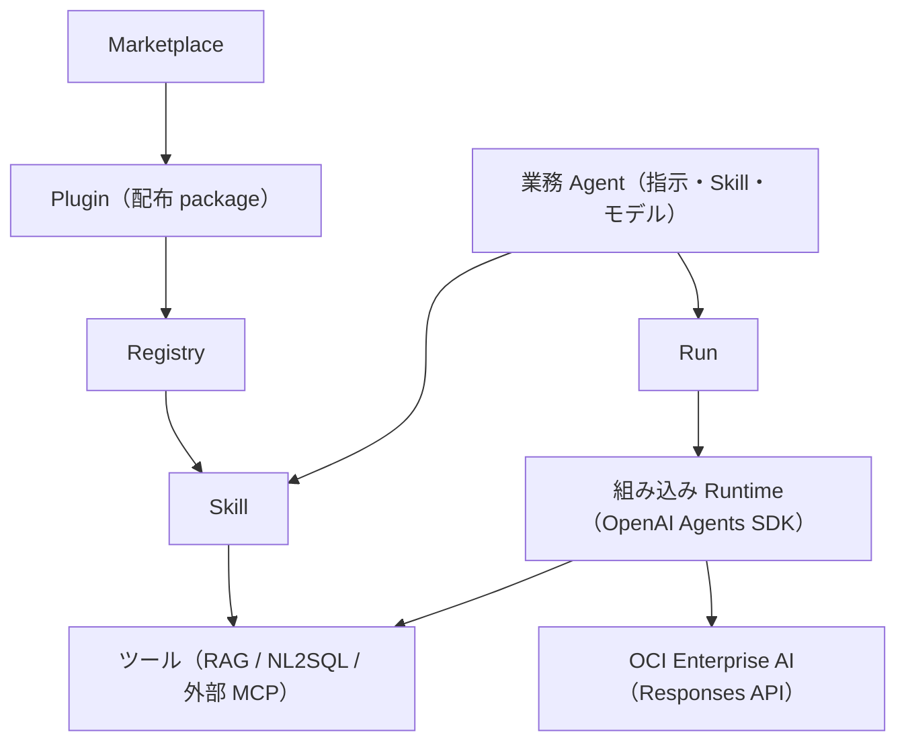

# Agent Platform 設計

## 1. Positioning

業務・業界の Agent を作り、Skill と MCP（RAG・NL2SQL・その他）を安全に使わせる製品。業務 Agent の定義と、
その実行（組み込み Runtime）、共通の Run・Event・Artifact・Approval・Audit を 1 つの製品で持つ。

#754 で、外部の Runtime（OpenClaw / Hermes / DeerFlow）への Binding による配置をやめ、Control Plane の中の
組み込み Runtime（OpenAI Agents SDK + OCI Enterprise AI の Responses API）で実行する形にした。
今後の作り変えは「Agent Platform 再設計案」（2026-10-02）に沿う。



## 2. Domain contracts

### Business Agent

`AgentProfile` の正式な編集対象は `name / description / instructions / skill_ids / model_id / enabled`。

版（#770）: 名前・説明・指示・Skill・モデルは「下書き」で、`POST /agents/{id}/publish` で版（`AgentVersion`: 版の番号・
内容・公開日時・公開者・メモ）を作り、`published_version` にする。通常の Run は公開中の版の内容で実行し
（`RunState.metadata.agent_version`）、公開していない Agent の Run は 409（`agent_unpublished`）。Agent 管理
（admin）は `RunCreateRequest.draft=true` で下書きを試せる（`agent_version="draft"`）。
`POST /agents/{id}/versions/{version}/restore` はその版を公開し直し、下書きもその内容にする（ロールバック）。
画面・API で作る Agent は下書きから始め、#770 より前の Agent（`versioned=false`）は読み込み時に現在の内容を
v1 として公開する。
利用者の Run を作る入口（チャットの選択肢・MCP の `agent_list_agents` / `agent_ask`・自動実行の作成と実行）は、
公開した版の無い Agent を出さず・選ばせない（`runtime.agent_unavailable_reason`。#792）。品質評価は下書きでも評価できる。
品質評価（#810）は評価の開始で「公開中の版」か「下書き」を選ぶ（`EvaluationRequest.agent_version`。省略時は公開して
いない変更があれば下書き、なければ公開中の版。公開した版が無ければ下書きだけ）。job は `agent_version`（版の番号か
`"draft"`）を残し、公開中の版は始めたときの版に固定して Run を作る（`create_builtin_run(agent_version=...)`。Run の
`metadata.agent_version` は #770 のまま）。前回との比較は同じ評価セット・同じ評価ケース（質問・期待・期待するツール）の
完了した job とだけ行い、比べた版（`previous_agent_version`）と日時を返す。
業種テンプレートから作った Agent は `template_id` を持ち（#810。以前の Agent は空のまま読める）、
`POST /evaluation-sets/from-template` でテンプレートの評価ケースの評価セットを作れる。フィードバック・Run の詳細の
「評価ケースに追加」は `GET /runs/{id}/evaluation-case`（質問・管理者のコメント・呼んだツールの下書き）と
`POST /evaluation-sets/{id}/cases`（同じ質問・50 件の上限は 409。出どころの `source_run_id` を残す）を使う。
Plugin、MCP、Tool、Runtime を Agent に埋め込まない。`tool_names` は移行リリースの読取互換だけである
（`command_allowed_prefixes` は #756 で削除した）。

### Skill

Skill は AgentSkills 互換の指示本体であり、次の内部依存を持つ。

```json
{
  "id": "business_rag_research",
  "instructions": "...",
  "mcp_requirements": [
    {"server_id": "rag", "tool_names": ["rag_search", "rag_list_search_answer_profiles"]}
  ],
  "resource_ids": []
}
```

`server_id` は MCP 接続の ID（`control-plane` は Control Plane のツール）。`tool_names` が空なら接続のすべての
ツールを使う。組み込み Runtime は、Agent の選択 Skill が要求するツールの和集合だけをモデルに渡す（指示への列挙だけで
権限を表現せず、渡すツールの一覧を実体として絞る）。

### Marketplace package

正式 manifest は `skills[] / mcp_servers[] / resources[]`。resource kind は `prompt / workflow /
template` で、初期実装は inline JSON/text のみ。resource を実行しない。

Install は事前に Skill/MCP/resource の重複と参照を検証し、衝突時に package 全体を拒否する。
旧 `agents[]` は Agent を作らず template resource に変換して warning を返す。参照中 Skill を持つ
package の disable/uninstall は `409`。

#### 外部カタログの互換インポート（#862）

`MarketplaceEntry` は配布先を示す一覧の項目であり、導入済みの `PluginManifest` と分ける。
更新ではカタログだけを取得し、1 項目の未対応・重複で他の項目を失わない。状態は
`not_fetched / ready / failed`。取得失敗では旧一覧を保持し、成功通知を出さず古い一覧と案内する。
URL がある配布元も、最後の一覧・revision・失敗状態を保存して復元する。

- 配布物の取得元は公開 GitHub の HTTPS。repository 内の相対 path、`url`、`github`、`git-subdir`、
  明示的な `skills` ディレクトリ、`ref` / 40 桁の `sha` に対応。raw カタログ URL の ref は 1 path segment。
  slash を含む branch は source の `ref` で指定する。`strict:false` の明示的な構成は既定のディレクトリより優先する。
- ref を commit SHA に確定して Git tree と raw の blob hash を照合。root 外の path、symlink、転送先への追従を断る。
  上限はカタログ 1,000 項目、Skill 40 件、HTTP 80 件、1 ファイル 1 MiB、全体 12 MiB、参照文書 4 MiB。
  Git tree は 8 MiB、取得期限は更新 10 秒・導入内容の取得 120 秒。同じ revision のファイルは取得単位で再利用する。
- `SKILL.md` の name・description・非空の instructions を保持する。Markdown の参照文書と利用条件の表示を
  非実行 resource に保存し、本文には resource ID / path だけを列挙する。割り当てた Skill の resource だけを
  `skill_reference_read` で 8,000 文字ずつ読む。指示の外部 URL や配布コードを自動で実行しない。
- 資格情報や動的設定を含まない HTTPS の HTTP MCP だけを登録する。stdio、commands、agents、hooks、LSP、
  scripts、Markdown 以外の補助ファイルは導入・実行の対象外とし、具体的な制約を表示する。
  元製品の `allowed-tools` は引き継がない。必要なツールはこの製品の MCP 接続で設定する。
- サービス外の保持を明示的に制限する利用条件を検出した Skill は本文の取得前に拒否する。
  その他の利用条件も導入前の確認対象であり、ライセンス適合性や業務実行を保証する機能ではない。
- `POST /api/plugins/marketplaces/{marketplace_id}/plugins/{plugin_id}/preview` は管理者だけが呼ぶ。
  導入は `preview_digest` と `accept_limitations` を必須とし、取得し直した内容が変わったら `409` で再確認する。
  ID は marketplace / plugin / path の namespace で分け、revision の更新だけでは変えない。
  変換した manifest は既存の原子的 install を使い、登録・保存の失敗は今回の全コンポーネントを撤去する。

固定実形式の fixture と実 HTTP の確認結果は `backend/tests/fixtures/marketplaces/README.md` を参照。
Claude Code の全機能の互換性や、Skill が業務のモデル・ツールで動くことの検証とは区別する。

### 組み込み Runtime（#754）

- `features/agent/builtin_runtime.py`。SDK は `openai-agents`（`pyproject.toml` で版を固定）。
- モデル: Agent の `model_id`（空なら「システム設定 > モデル」の既定のテキストモデル）と、その接続（Endpoint・API key・
  Project OCID）。`OpenAIResponsesModel` に OCI の OpenAI 互換の base URL を渡す。xAI のモデルは空の `tools` を
  拒否するため、ツールが無い呼び出しでは `tools` / `tool_choice` を送らない（`OciResponsesModel`）。
- 指示: 共通の前置き（日本語・根拠・推測しない）＋ Agent の指示 ＋ 割り当てた Skill の指示。
- ツール: Skill の requirement が要求するツールを `FunctionTool` にする。`control-plane` は `tool_registry` の
  ツール、それ以外は MCP 接続の `tools/list`（Run の利用者として取得。名前は `<接続>__<ツール>`、英数字・`_`・`-`
  で 64 文字以内）。取得できない接続は飛ばして Run に `runtime.event`（warning）を残す（#757）。
  実行は `tool_registry.invoke`（ポリシー・ガードレール・監査・成果物、サービストークン）。
  ポリシーの「拒否」は渡さず、「承認」は `needs_approval=True`（MCP のツールは `readOnlyHint` が無ければ既定で承認）。
- 承認: SDK の中断（`result.interruptions`）で承認待ちの step と ApprovalRequest を作り、`result.to_state().to_string()`
  を Run の metadata（`_builtin_sdk_state`）に保存して `waiting_approval` にする。すべて決まると `queued` に戻り、
  状態を復元して承認・却下を反映し再開する。承認済みのツールは中断時の step を実行中にして結果を記録する。
- tracing: `set_tracing_disabled(True)`（業務データを外部へ送らない）。
- テスト: SDK の `agents.testing.ScriptedModel` でモデルを台本にする（`tests/test_builtin_runtime.py`）。

### RunState

共通 Run は状態/Event/Artifact/Approval/Audit と `runtime_id`（新しい Run は `builtin`）を持つ。
`POST /api/runs` は `agent_id` と `goal` だけを受け取り、組み込み Runtime で実行する。モデルの最終回答は
`kind="answer"` の Artifact に残す。

## 3. ツールとポリシー

Control Plane のツール（`echo` / `agent_skill_list`）は `tool_registry` に登録する。MCP 接続のツールは登録せず、
Run ごとに `tools/list` から作ったツール定義を `tool_registry.invoke` に渡し、ToolPolicy、PII/secret masking、
audit metadata、成果物の保存を再利用する（#757）。外部 Runtime 向けの Binding MCP（`/api/mcp/{binding_id}`）
と adapter 契約（`probe_capabilities / sync_binding / submit_run / ...`）は #754 で削除した。

## 4. 製品の MCP

### 4.1 MCP 接続（RAG / NL2SQL / 外部 MCP。#233 / #757）

RAG / NL2SQL / 外部 MCP は「MCP 接続」（`config.McpConnectionConfig`、API `/api/settings/mcp-connections`）で
管理する。RAG / NL2SQL は組み込みの接続 `rag` / `nl2sql`（各製品の `POST /api/mcp`。認証はサービストークン、
aud は製品名。削除できない）。外部の MCP は画面・`AGENT_EXTERNAL_MCP_SERVERS_JSON`・プラグインで追加し、
認証方式は なし / API キー / OAuth client credentials / サービストークン。ツールは呼び先の契約（RAG / NL2SQL は
`platform/contracts/mcp/`）をそのまま使い、Agent は引数を作り変えない。

| ツール（モデルに渡す名前） | readOnlyHint | 既定の policy |
|---|---|---|
| `rag__rag_search` / `rag__rag_list_search_answer_profiles` | true | 承認なし（回答生成に LLM を使う） |
| `nl2sql__nl2sql_list_profiles` / `nl2sql__nl2sql_recommend_profile` / `nl2sql__nl2sql_get_job` | true | 承認なし |
| `nl2sql__nl2sql_query` | false | 承認が必要（業務 DB へ SQL を実行する） |

RAG のチャットは MCP で提供しない（#787）。RAG の MCP は検索（`rag_search`）と検索・回答プロファイルの一覧だけを持つ。

ツール権限（`/settings/tool-policy`）は `<接続>__<ツール>` の名前で allow / ask / deny を上書きできる。
NL2SQL の SQL に書き込みの文があれば `nl2sql.non_readonly_sql_returned_as_audit_only` の警告を残す（実行はしない）。

- **利用者**: Run の作成時に、ログイン中の利用者（Cookie のセッション。local mode ではローカル利用者）の
  `user_uuid` を `RunState.created_by_user_uuid` に記録する（checkpoint の JSON に入る。項目がない既存の Run は
  None）。Run からのツール呼び出し
  （承認後の再実行を含む）は `ToolInvocationContext.user_uuid` / `run_id` にこの値を入れるため、承認者ではなく
  Run を作った利用者として呼ぶ。再実行（replay）の Run は、再実行を指示した利用者になる。単発の
  `POST /tools/invoke` と画面の「ツールを取得」（`GET /settings/mcp-connections/{id}/tools`）は、ログイン中の利用者として呼ぶ。
- **token**（サービストークンの接続）: 呼び出しごとに `issue_service_token(PLATFORM_SERVICE_TOKEN_SECRET, subject=<Run の利用者 or
  サービス利用者>, audience=<接続の audience>, issuer="agent", claims={"run_id", "agent_id"})`（HS256、60 秒）を
  作り、`Authorization: Bearer` で送る。署名鍵は 3 製品の共通 `.env` で同じ値にする（32 文字以上。未設定なら
  `mcp.service_token_not_configured`）。サービス利用者の login ID → `user_uuid` は共通認証の store で解決し、
  プロセス内にキャッシュする。
- **MCP の手順**: 呼び出しごとに `initialize`（`2025-06-18`）→ `notifications/initialized` → `tools/call`。
  応答の `Mcp-Session-Id` を以降の request に付け、`Accept: application/json, text/event-stream` と
  `MCP-Protocol-Version` を送る。結果は `structuredContent`（無ければ text の `content`）、`isError: true` は
  `mcp.tool_error`（呼び先の `error_code` / `message` / `status` を `error_details` に入れる）。SSE の途中経過と
  paging は扱わない。すべての接続が同じ client（`McpConnectionClient`）を使う。固定の session id を設定した接続には
  `initialize` を送らず、`initialize` を持たない接続（`-32601`）はそのまま `tools/*` を呼ぶ。
- **再試行と期限（#854）**: 1 メッセージを `AGENT_EXTERNAL_MCP_MAX_RETRIES`（既定 3）回まで再試行する。分類は MCP の意味に合わせる。

  | 失敗 | 手順（`initialize`・`notifications/initialized`・`tools/list`） | 読み取り専用（`readOnlyHint=true`）の `tools/call` | それ以外の `tools/call` |
  |---|---|---|---|
  | 送信前（`ConnectError`・`ConnectTimeout`・`PoolTimeout`）・429・503 | 再試行 | 再試行 | 再試行 |
  | 502・504・通信の途中の切断 | 再試行 | 再試行 | しない |
  | 500・読み取りの timeout | 再試行 | しない | しない |

  書き込みのツール（`nl2sql_query` など）は、呼び先に届いた可能性がある失敗では再送しない（SQL の実行・LLM の呼び出しを
  重複させない）。読み取り専用のツールも、読み取りの timeout は再送しない（`rag_search` のように呼び先で LLM が動いている）。
  待ちは 0.5 秒から 2 倍ずつ（上限 8 秒、後半を jitter）、429 / 503 の `Retry-After`（秒・HTTP 日付）があればその値（上限 30 秒）。
  1 回のツールの呼び出し（`initialize` から `tools/call` まで）全体を接続の timeout で区切り、各 POST の timeout は残りの時間
  （接続の確立は 10 秒以下）、待つと期限まで 1 秒を切るときは再試行しない。待ちは `tools._retry_sleep` で差し替える（テストは
  待たない）。最後の失敗は利用者の言葉のメッセージ（例:「MCP 接続「RAG」に接続できません（RAG のサービスが起動しているか、
  接続の URL が正しいかを確認してください）。」）と code（送信前の失敗 `mcp.unreachable`、ほか `mcp.timeout` / `mcp.http_error` /
  `mcp.request_error`。`error_details` に `attempts`・`retryable`）のツールの失敗としてモデルへ返し、Run は続く（モデルが
  利用者に伝える）。ツールの一覧が取れない接続は従来どおり飛ばして warning を残す。
- **NL2SQL のジョブの完了を待つ（#848）**: 組み込みの接続 `nl2sql` の `nl2sql_query` / `nl2sql_get_job` の結果が
  `pending` / `running`（`job_id` あり）なら、ツールの handler の中で `nl2sql_get_job` を `wait_seconds`（最大 20 秒。
  接続の timeout から 15 秒引いた値以下）付きで繰り返し呼び、完了した結果をモデルに返す。待つ合計の上限は
  `AGENT_NL2SQL_JOB_WAIT_SECONDS`（既定 300 秒、0 で待たない）で、1 回の待ちごとに Run がキャンセル・終了していないかを
  確かめる。上限を超えた・Run が終わった・続きの取得に失敗したときは最後の結果（`running` と `job_id`）を返す。
  SDK の function tool の timeout は待つ分を足した値にする。外部の MCP 接続のツールは対象外。
- **設定**: `AGENT_EXTERNAL_RAG_MCP_URL` / `AGENT_EXTERNAL_NL2SQL_MCP_URL`（例 `http://rag-host/api/mcp`）、
  `AGENT_EXTERNAL_RAG_TIMEOUT_SECONDS` / `AGENT_EXTERNAL_NL2SQL_TIMEOUT_SECONDS`（既定 60 秒）は接続 `rag` / `nl2sql` の
  初期値。画面の「MCP 接続」で URL・タイムアウトを変更でき（保存先に残り、.env の値より優先する。#764）、署名鍵と
  サービス利用者は設定済みかどうかだけを表示する。旧「外部 MCP」の単一の設定（`AGENT_EXTERNAL_MCP_BASE_URL` 等）・
  既定のサーバー・NL2SQL の既定取得件数（`AGENT_EXTERNAL_NL2SQL_DEFAULT_LIMIT`）は #757 で削除した。

## 5. Dispatcher and persistence

開発時は API のプロセスで実行する（`AGENT_RUNTIME_DISPATCH_MODE=in_process`。asyncio の task）。本番で別プロセスに
する場合は `runtime-dispatcher`（`python -m app.features.agent.runtime_dispatcher`）が Oracle checkpoint row を
`SELECT ... FOR UPDATE` し、queued の組み込み Runtime の Run に期限付き lease を付けて claim し、実行・再開する。
実行を始めたら lease を外す（承認の決定で queued に戻った Run を、すぐ claim できるようにする）。別 queue 製品は追加しない。

外部 dispatcher は `AGENT_RUNTIME_REPOSITORY_BACKEND=oracle_checkpoint|oracle_normalized` が前提。
memory backend は process 間共有されないため production dispatcher に使用しない。

### 5.1 保存先（#764）

保存先は `AGENT_RUNTIME_REPOSITORY_BACKEND`（既定 `auto`。#839）。`auto` は起動時に 1 回だけ、共通の `PLATFORM_ORACLE_*` の
設定がそろっていれば `oracle_checkpoint`、無ければ `memory` に決め（`app/features/agent/storage_backend.py`）、Run の repository・
定義の store・Run の事実が同じ決定に従う。`auto` で選んだ Oracle に起動時に接続できない（接続のエラー）ときは memory で起動し、
再起動を案内する（明示した `oracle_*` は従来どおり起動を止める。接続以外のエラーも止める）。今の保存先は `GET /api/runtime/storage`（`backend`・
`persistent`・`database_configured`・`reason`。接続先は返さない。#839）で分かり、「運用設定 > 実行環境」の「保存先」の
カードが `StatusBadge` と直し方を出す。保存していない（`persistent=false`）ときは、業務 Agent・スキル・プラグイン・
マーケットプレイス・実行履歴・自動実行・品質評価・MCP 接続・API キー・ツール権限・バックアップと復元・システムテーブルの
画面の先頭に warning の Banner（`NonPersistentStorageNotice`）を出し、実行環境へ案内する。理由は、DB の設定がそろって
いれば `memory_backend`（memory などを明示。保存先の設定を直す）か `restart_required`（`auto` で起動時は DB を使えなかった。
再起動する）、そろっていなければ `database_not_configured`（DB の設定から直す）。`auto` で保存済みの checkpoint 全体が読めず memory で
起動したときは `checkpoint_invalid`（#853。§5.1.1）。

| 対象 | memory | file | oracle_checkpoint / oracle_normalized |
|---|---|---|---|
| Run・業務 Agent | プロセス内 | `AGENT_RUNTIME_SNAPSHOT_PATH` の JSON | `AGENT_RUNTIME_CHECKPOINTS`（snapshot の CLOB）。normalized は監査用の `AGENT_RUNTIME_RUNS/EVENTS/STEPS/APPROVALS/ARTIFACTS` も書く |
| 画面・API で変えた定義（Skill・プラグイン・マーケットプレイス・MCP 接続・ツール権限） | 保存しない | snapshot の隣の `<名前>.control-plane.json` | `AGENT_CONTROL_PLANE_ITEMS`（`ITEM_KIND` × `ITEM_ID` の JSON） |
| 利用状況・フィードバックの集計に使う Run の事実（#794） | 保存しない（メモリの Run をその場で集計） | 保存しない（同左） | `AGENT_RUN_FACTS`（1 Run = 1 行。SQL で集計） |

- Oracle は共通の `PLATFORM_ORACLE_*` で接続する（旧 `AGENT_RUNTIME_ORACLE_*` は読まない）。テーブルはシステムテーブル
  （`app.system_schema` の migration 006）が作り、アプリは DDL を実行しない。テーブルが無いあいだは空の状態で起動し、
  定義の保存は「システムテーブルで作成・更新してください」で断る。全再作成はこれらのテーブルも消す（Run の履歴も消える）。
- 定義は API の変更の後に保存し（`control_plane_store.save_*`）、起動時（`app.main` の lifespan）に
  `restore_control_plane()` で `.env` の宣言の後に重ねる。RAG / NL2SQL の接続は画面で変えた URL・タイムアウトだけを
  上書きする（認証方式は変えない）。`.env` の宣言・組み込みの定義は保存しない。
- MCP 接続の API キー・OAuth の client secret は、`PLATFORM_SERVICE_TOKEN_SECRET` から HKDF-SHA256 で導いた鍵の
  Fernet で暗号化して保存する（`app.secret_box`。`enc:v1:...`）。署名鍵を変えると復号できないため、その接続の秘密は
  画面で入れ直す。署名鍵が無いと秘密を含む接続は保存できない（503）。
- 1 worker・`in_process` の前提は変えない（checkpoint は process 内の状態を丸ごと書くため）。

### 5.1.1 起動時の読み込みと再試行（#853）

保存先の 1 件の不整合で backend（module の import）を止めない。読み込み（Oracle の checkpoint・file の snapshot・
dispatcher の claim）は `runtime.load_snapshot_tolerant` で、snapshot を JSON として読み、Run・業務 Agent を 1 件ずつ検証する。

- **直す**（`_repair_run`。待ちを終わらせる方向だけで、承認・再開の方向には直さない）: 終わった Run に残った pending の承認 →
  `cancelled`（`decided_by="system:storage-repair"`、承認待ちの step も `cancelled`）、承認待ちなのに pending の承認が無い Run →
  `failed`（`runtime.inconsistent_state`）、Event / step / 承認の `run_id` のずれ → 入っている Run に合わせる、無い承認を指す
  step → 参照を外す。直した内容は Run の `runtime.event`（`payload.source="storage_repair"`）とログ
  `agent_runtime_snapshot_run_repaired` に残す。
- **退避する**: schema に合わない・id が空 / 重複・直しても整合しない（承認が無い step を指すなど）Run・業務 Agent は読み込まず、
  元の JSON と理由を snapshot の `quarantined` に入れる（ログ `agent_runtime_snapshot_record_quarantined`）。次の保存でも
  `quarantined` は残り、バックアップの書き出しで中身を確かめられる（黙って消さない）。
- 直した・退避したら、読み込みの直後に保存する（失敗しても起動は止めない）。件数は `GET /api/runtime/storage` の
  `repaired_runs`（この起動で直した Run）・`skipped_runs` / `skipped_agents`（退避している数）と「保存先」のカードに出す。
- snapshot 全体が読めない（JSON の破損・object でない・未対応の版）ときだけ止める。`auto` は checkpoint を上書きしないよう
  memory で起動し、`reason=checkpoint_invalid` で案内する。明示した `oracle_*` / `file` は、直し方（行・ファイルを退避して
  削除するか、バックアップを戻す）を書いた例外で起動を止める（データの保護）。
- 利用者が明示的に行う復元（`replace_snapshot`）は今までどおり厳密に検証して拒否する。
- 起動時の DB の接続のエラー（`is_oracle_connection_error`）は、`AGENT_RUNTIME_STORAGE_CONNECT_RETRIES`（既定 2）回まで、
  `AGENT_RUNTIME_STORAGE_CONNECT_RETRY_DELAY_SECONDS`（既定 2 秒）から 2 倍ずつ（上限 30 秒、後半を jitter）待って再試行する。
  1 回の接続の上限は `PLATFORM_ORACLE_TCP_CONNECT_TIMEOUT_SECONDS`。接続以外のエラーは再試行しない。それでも接続できなければ
  `auto` は memory（#851）、明示した `oracle_*` は ORA / DPY のコードと直し方を書いた例外で止める。待ちは
  `runtime._retry_sleep` で差し替える（テストは待たない）。
- runtime-dispatcher は 1 回の claim・実行の失敗で止まらず、ログを残して poll の間隔から 2 倍ずつ（上限 60 秒）待って続ける。

### 5.2 Run の事実と集計（#794）

- 利用状況（#772）・フィードバック（#774）は、Oracle の構成では `AGENT_RUN_FACTS`（migration 007）を SQL で集計する。
  期間は 7 / 30 / 90 / 180 / 365 日。日は `FROM_TZ(CREATED_AT, 'UTC') AT TIME ZONE :timezone`（画面のブラウザの
  タイムゾーン）で区切り、対象は Run の一覧と同じく利用できる業務 Agent だけ。フィードバックの一覧は
  `offset` / `limit` でサーバー側でページングする（新しい順。`RATED_AT DESC, RUN_ID DESC`）。
- 1 Run = 1 行（業務 Agent・版・利用者・状態・起点・モデルの利用量・本人と管理者の評価・質問・回答・日時）。
  日時は UTC の `TIMESTAMP`（タイムゾーンなし）。Runtime repository が作成・状態の変化・利用量・評価の時点で
  事実をキューに入れ、バックグラウンドのスレッドがまとめて MERGE する（`run_facts_store`。Run を待たせない・止めない。
  失敗はログ `agent_run_facts_not_saved` に残して捨てる）。起動時に Runtime repository の全 Run を backfill する。
- テーブルが無い・DB の障害のあいだは、メモリの Run の集計に戻す（応答の `source` が `memory`。画面に集計元を出す）。
  memory / file の構成は保存せず、メモリの Run を集計する（`source=memory`）。
- 品質評価（#776）の job は件数（旧 50 件）ではなく期間（終わった job を 365 日。安全のため 2,000 件まで）で残し、
  `GET /api/evaluations` を `offset` / `limit` でページングする。前回との比較は残っている全 job から探す。

## 7. Snapshot migration

Snapshot v2 は runs/agents を持つ（旧版の `control_plane_state.runtimes/bindings`（#754）と `memory`（#756）は読み込んでも使わない）。

- v1 tool を一意に対応できる Skill へ推定。
- 変換不能 tool があれば `migration_required=true`, `enabled=false`。
- 既存 Run は model default により `runtime_id=legacy-native`。
- 旧エンジンの Memory・v1 Run（`X-Agent-API-Version: 1`）・planner は #756 で削除した。

## 8. UI information architecture

サイドナビは上に一般の利用者の画面（AI 活用：チャット / 実行履歴 / 承認）、その下に管理者の画面（Agent 構築：業務 Agent / スキル / 自動実行 / マーケットプレイス、改善・運用、セキュリティ設定、ユーザーとロール、運用設定、システム設定）を置く（#791。構成は docs/frontend-page-archetypes-spec.md）。Agent 画面では指示・Skill・モデルを選ぶ。

チャット（`/chat`。#768）は業務利用者の入口。使ってよい Agent を選び、会話の履歴（lg 以上は左、未満は side sheet）・
会話・入力欄を出す（RAG のチャットと同じ型）。1 往復が 1 Run で、`RunCreateRequest.thread_id` で会話を続ける
（省略すると新しい会話。`RunState.thread_id` に入る）。組み込み Runtime は同じ会話の完了した前の Run の質問と回答
（`kind="answer"` の成果物）を直近 10 往復までモデルの入力に付ける。会話の一覧・詳細は `GET /threads`・
`GET /threads/{thread_id}`（作った利用者だけ。別の利用者・別の Agent の会話は 404 で、続けることもできない）。
回答の下に出典（`rag_evidence` の引用）・使ったツール（step）を畳んで出し、承認待ちはその場で承認・却下する
（`agent.approvals.decide` を持つ利用者だけ）。実行中・承認待ちのあいだは次の質問を送れない（前の回答を履歴に含めるため）。
Run は Agent とゴールだけを受け取る（実行先の選択は無い）。Runtime 画面は組み込み Runtime の状態（SDK の版・既定のモデル・
選べるモデル・実行できるか）と、モデル未設定のときの理由と「システム設定 > モデル」への導線を出す。

## 9. Authentication and RBAC

画面は RAG / NL2SQL と同じ共通認証（`PLATFORM_*` のユーザー・ロール・セッション）でログインする。ロールに付ける
Agent の権限（`AGENT_ROLE_PERMISSIONS`）と対象範囲（`AGENT_ROLE_AGENTS`）は
システムテーブル（`app.system_schema`。#751）が作る。capability は従来の viewer / operator / approver / auditor / admin に対応し、
利用者（Cookie のセッション、local はローカル利用者）から `ActorPolicy` を作って Run・監査・承認・成果物・SSE・WebSocket・
`GET /agents` の絞り込みに流す。Cookie のないリクエストは 401（#750 で header / JWT / 外部 policy の認可を削除した）。
検索・回答プロファイルの判定は RAG が Run の利用者のサービストークンで行うため、Agent は検索・回答プロファイルの対象範囲を持たない（#750）。
詳細は [security-rbac.md](security-rbac.md)。

## 10. Non-goals

- 外部の Agent Runtime（OpenClaw / Hermes / DeerFlow など）への配置と adapter（#754 で削除）
- 独立した planner / workflow engine
- 外部 archive の Marketplace install
