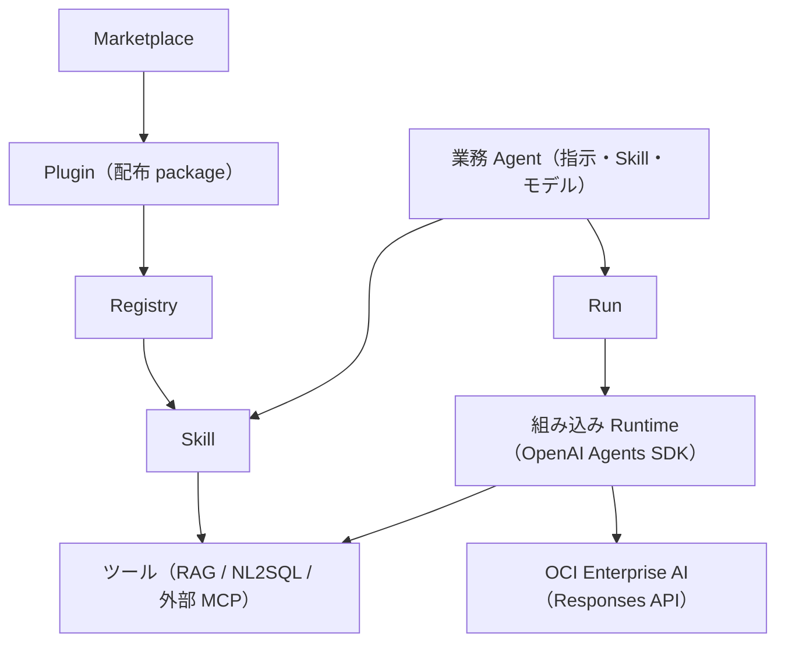

# Agent Platform 設計

## 1. Positioning

業務・業界の Agent を作り、Skill と MCP（RAG・NL2SQL・その他）を安全に使わせる製品。業務 Agent の定義と、
その実行（組み込み Runtime）、共通の Run・Event・Artifact・Approval・Audit を 1 つの製品で持つ。

#754 で、外部の Runtime（OpenClaw / Hermes / DeerFlow）への Binding による配置をやめ、Control Plane の中の
組み込み Runtime（OpenAI Agents SDK + OCI Enterprise AI の Responses API）で実行する形にした。
今後の作り変えは「Agent Platform 再設計案」（2026-10-02）に沿う。



## 2. Domain contracts

### Business Agent

`AgentProfile` の正式な編集対象は `name / description / instructions / skill_ids / model_id / enabled`。

版（#770）: 名前・説明・指示・Skill・モデルは「下書き」で、`POST /agents/{id}/publish` で版（`AgentVersion`: 版の番号・
内容・公開日時・公開者・メモ）を作り、`published_version` にする。通常の Run は公開中の版の内容で実行し
（`RunState.metadata.agent_version`）、公開していない Agent の Run は 409（`agent_unpublished`）。Agent 管理
（admin）は `RunCreateRequest.draft=true` で下書きを試せる（`agent_version="draft"`）。
`POST /agents/{id}/versions/{version}/restore` はその版を公開し直し、下書きもその内容にする（ロールバック）。
画面・API で作る Agent は下書きから始め、#770 より前の Agent（`versioned=false`）は読み込み時に現在の内容を
v1 として公開する。
Plugin、MCP、Tool、Runtime を Agent に埋め込まない。`tool_names` は移行リリースの読取互換だけである
（`command_allowed_prefixes` は #756 で削除した）。

### Skill

Skill は AgentSkills 互換の指示本体であり、次の内部依存を持つ。

```json
{
  "id": "business_rag_research",
  "instructions": "...",
  "mcp_requirements": [
    {"server_id": "rag", "tool_names": ["rag_search", "rag_list_business_views"]}
  ],
  "resource_ids": []
}
```

`server_id` は MCP 接続の ID（`control-plane` は Control Plane のツール）。`tool_names` が空なら接続のすべての
ツールを使う。組み込み Runtime は、Agent の選択 Skill が要求するツールの和集合だけをモデルに渡す（指示への列挙だけで
権限を表現せず、渡すツールの一覧を実体として絞る）。

### Marketplace package

正式 manifest は `skills[] / mcp_servers[] / resources[]`。resource kind は `prompt / workflow /
template` で、初期実装は inline JSON/text のみ。resource を実行しない。

Install は事前に Skill/MCP/resource の重複と参照を検証し、衝突時に package 全体を拒否する。
旧 `agents[]` は Agent を作らず template resource に変換して warning を返す。参照中 Skill を持つ
package の disable/uninstall は `409`。

### 組み込み Runtime（#754）

- `features/agent/builtin_runtime.py`。SDK は `openai-agents`（`pyproject.toml` で版を固定）。
- モデル: Agent の `model_id`（空なら「システム設定 > モデル」の既定のテキストモデル）と、その接続（Endpoint・API key・
  Project OCID）。`OpenAIResponsesModel` に OCI の OpenAI 互換の base URL を渡す。xAI のモデルは空の `tools` を
  拒否するため、ツールが無い呼び出しでは `tools` / `tool_choice` を送らない（`OciResponsesModel`）。
- 指示: 共通の前置き（日本語・根拠・推測しない）＋ Agent の指示 ＋ 割り当てた Skill の指示。
- ツール: Skill の requirement が要求するツールを `FunctionTool` にする。`control-plane` は `tool_registry` の
  ツール、それ以外は MCP 接続の `tools/list`（Run の利用者として取得。名前は `<接続>__<ツール>`、英数字・`_`・`-`
  で 64 文字以内）。取得できない接続は飛ばして Run に `runtime.event`（warning）を残す（#757）。
  実行は `tool_registry.invoke`（ポリシー・ガードレール・監査・成果物、サービストークン）。
  ポリシーの「拒否」は渡さず、「承認」は `needs_approval=True`（MCP のツールは `readOnlyHint` が無ければ既定で承認）。
- 承認: SDK の中断（`result.interruptions`）で承認待ちの step と ApprovalRequest を作り、`result.to_state().to_string()`
  を Run の metadata（`_builtin_sdk_state`）に保存して `waiting_approval` にする。すべて決まると `queued` に戻り、
  状態を復元して承認・却下を反映し再開する。承認済みのツールは中断時の step を実行中にして結果を記録する。
- tracing: `set_tracing_disabled(True)`（業務データを外部へ送らない）。
- テスト: SDK の `agents.testing.ScriptedModel` でモデルを台本にする（`tests/test_builtin_runtime.py`）。

### RunState

共通 Run は状態/Event/Artifact/Approval/Audit と `runtime_id`（新しい Run は `builtin`）を持つ。
`POST /api/runs` は `agent_id` と `goal` だけを受け取り、組み込み Runtime で実行する。モデルの最終回答は
`kind="answer"` の Artifact に残す。

## 3. ツールとポリシー

Control Plane のツール（`echo` / `agent_skill_list`）は `tool_registry` に登録する。MCP 接続のツールは登録せず、
Run ごとに `tools/list` から作ったツール定義を `tool_registry.invoke` に渡し、ToolPolicy、PII/secret masking、
audit metadata、成果物の保存を再利用する（#757）。外部 Runtime 向けの Binding MCP（`/api/mcp/{binding_id}`）
と adapter 契約（`probe_capabilities / sync_binding / submit_run / ...`）は #754 で削除した。

## 4. 製品の MCP

### 4.1 MCP 接続（RAG / NL2SQL / 外部 MCP。#233 / #757）

RAG / NL2SQL / 外部 MCP は「MCP 接続」（`config.McpConnectionConfig`、API `/api/settings/mcp-connections`）で
管理する。RAG / NL2SQL は組み込みの接続 `rag` / `nl2sql`（各製品の `POST /api/mcp`。認証はサービストークン、
aud は製品名。削除できない）。外部の MCP は画面・`AGENT_EXTERNAL_MCP_SERVERS_JSON`・連携機能で追加し、
認証方式は なし / API キー / OAuth client credentials / サービストークン。ツールは呼び先の契約（RAG / NL2SQL は
`platform/contracts/mcp/`）をそのまま使い、Agent は引数を作り変えない。

| ツール（モデルに渡す名前） | readOnlyHint | 既定の policy |
|---|---|---|
| `rag__rag_search` / `rag__rag_list_business_views` / `rag__rag_chat_get_conversation` | true | 承認なし（回答生成に LLM を使う） |
| `rag__rag_chat_send_message` | false | 承認が必要（RAG に会話を作成・追記する） |
| `nl2sql__nl2sql_list_profiles` / `nl2sql__nl2sql_recommend_profile` / `nl2sql__nl2sql_get_job` | true | 承認なし |
| `nl2sql__nl2sql_query` | false | 承認が必要（業務 DB へ SQL を実行する） |

ツール権限（`/settings/tool-policy`）は `<接続>__<ツール>` の名前で allow / ask / deny を上書きできる。
NL2SQL の SQL に書き込みの文があれば `nl2sql.non_readonly_sql_returned_as_audit_only` の警告を残す（実行はしない）。

- **利用者**: Run の作成時に、ログイン中の利用者（Cookie のセッション。local mode ではローカル利用者）の
  `user_uuid` を `RunState.created_by_user_uuid` に記録する（checkpoint の JSON に入る。項目がない既存の Run は
  None）。Run からのツール呼び出し
  （承認後の再実行を含む）は `ToolInvocationContext.user_uuid` / `run_id` にこの値を入れるため、承認者ではなく
  Run を作った利用者として呼ぶ。再実行（replay）の Run は、再実行を指示した利用者になる。単発の
  `POST /tools/invoke` と画面の「ツールを取得」（`GET /settings/mcp-connections/{id}/tools`）は、ログイン中の利用者として呼ぶ。
- **token**（サービストークンの接続）: 呼び出しごとに `issue_service_token(PLATFORM_SERVICE_TOKEN_SECRET, subject=<Run の利用者 or
  サービス利用者>, audience=<接続の audience>, issuer="agent", claims={"run_id", "agent_id"})`（HS256、60 秒）を
  作り、`Authorization: Bearer` で送る。署名鍵は 3 製品の共通 `.env` で同じ値にする（32 文字以上。未設定なら
  `mcp.service_token_not_configured`）。サービス利用者の login ID → `user_uuid` は共通認証の store で解決し、
  プロセス内にキャッシュする。
- **MCP の手順**: 呼び出しごとに `initialize`（`2025-06-18`）→ `notifications/initialized` → `tools/call`。
  応答の `Mcp-Session-Id` を以降の request に付け、`Accept: application/json, text/event-stream` と
  `MCP-Protocol-Version` を送る。結果は `structuredContent`（無ければ text の `content`）、`isError: true` は
  `mcp.tool_error`（呼び先の `error_code` / `message` / `status` を `error_details` に入れる）。SSE の途中経過と
  paging は扱わない。すべての接続が同じ client（`McpConnectionClient`）を使う。固定の session id を設定した接続には
  `initialize` を送らず、`initialize` を持たない接続（`-32601`）はそのまま `tools/*` を呼ぶ。
- **再試行**: `tools/call` は 502 / 504・timeout で再試行しない（読み取り専用でも LLM を使うツール（`rag_search`）が
  あり、処理が進んでいる可能性がある）。429 / 503 と接続失敗だけ `AGENT_EXTERNAL_MCP_MAX_RETRIES` 回まで再試行する。
  `tools/list` は 429 / 5xx・timeout も再試行する。
- **設定**: `AGENT_EXTERNAL_RAG_MCP_URL` / `AGENT_EXTERNAL_NL2SQL_MCP_URL`（例 `http://rag-host/api/mcp`）、
  `AGENT_EXTERNAL_RAG_TIMEOUT_SECONDS` / `AGENT_EXTERNAL_NL2SQL_TIMEOUT_SECONDS`（既定 60 秒）は接続 `rag` / `nl2sql` の
  初期値。画面の「MCP 接続」で URL・タイムアウトを変更でき（保存先に残り、.env の値より優先する。#764）、署名鍵と
  サービス利用者は設定済みかどうかだけを表示する。旧「外部 MCP」の単一の設定（`AGENT_EXTERNAL_MCP_BASE_URL` 等）・
  既定のサーバー・NL2SQL の既定取得件数（`AGENT_EXTERNAL_NL2SQL_DEFAULT_LIMIT`）は #757 で削除した。

## 5. Dispatcher and persistence

開発時は API のプロセスで実行する（`AGENT_RUNTIME_DISPATCH_MODE=in_process`。asyncio の task）。本番で別プロセスに
する場合は `runtime-dispatcher`（`python -m app.features.agent.runtime_dispatcher`）が Oracle checkpoint row を
`SELECT ... FOR UPDATE` し、queued の組み込み Runtime の Run に期限付き lease を付けて claim し、実行・再開する。
実行を始めたら lease を外す（承認の決定で queued に戻った Run を、すぐ claim できるようにする）。別 queue 製品は追加しない。

外部 dispatcher は `AGENT_RUNTIME_REPOSITORY_BACKEND=oracle_checkpoint|oracle_normalized` が前提。
memory backend は process 間共有されないため production dispatcher に使用しない。

### 5.1 保存先（#764）

| 対象 | memory | file | oracle_checkpoint / oracle_normalized |
|---|---|---|---|
| Run・業務 Agent | プロセス内 | `AGENT_RUNTIME_SNAPSHOT_PATH` の JSON | `AGENT_RUNTIME_CHECKPOINTS`（snapshot の CLOB）。normalized は監査用の `AGENT_RUNTIME_RUNS/EVENTS/STEPS/APPROVALS/ARTIFACTS` も書く |
| 画面・API で変えた定義（Skill・プラグイン・マーケットプレイス・MCP 接続・ツール権限） | 保存しない | snapshot の隣の `<名前>.control-plane.json` | `AGENT_CONTROL_PLANE_ITEMS`（`ITEM_KIND` × `ITEM_ID` の JSON） |

- Oracle は共通の `PLATFORM_ORACLE_*` で接続する（旧 `AGENT_RUNTIME_ORACLE_*` は読まない）。テーブルはシステムテーブル
  （`app.system_schema` の migration 006）が作り、アプリは DDL を実行しない。テーブルが無いあいだは空の状態で起動し、
  定義の保存は「システムテーブルで作成・更新してください」で断る。全再作成はこれらのテーブルも消す（Run の履歴も消える）。
- 定義は API の変更の後に保存し（`control_plane_store.save_*`）、起動時（`app.main` の lifespan）に
  `restore_control_plane()` で `.env` の宣言の後に重ねる。RAG / NL2SQL の接続は画面で変えた URL・タイムアウトだけを
  上書きする（認証方式は変えない）。`.env` の宣言・組み込みの定義は保存しない。
- MCP 接続の API キー・OAuth の client secret は、`PLATFORM_SERVICE_TOKEN_SECRET` から HKDF-SHA256 で導いた鍵の
  Fernet で暗号化して保存する（`app.secret_box`。`enc:v1:...`）。署名鍵を変えると復号できないため、その接続の秘密は
  画面で入れ直す。署名鍵が無いと秘密を含む接続は保存できない（503）。
- 1 worker・`in_process` の前提は変えない（checkpoint は process 内の状態を丸ごと書くため）。

## 7. Snapshot migration

Snapshot v2 は runs/agents を持つ（旧版の `control_plane_state.runtimes/bindings`（#754）と `memory`（#756）は読み込んでも使わない）。

- v1 tool を一意に対応できる Skill へ推定。
- 変換不能 tool があれば `migration_required=true`, `enabled=false`。
- 既存 Run は model default により `runtime_id=legacy-native`。
- 旧エンジンの Memory・v1 Run（`X-Agent-API-Version: 1`）・planner は #756 で削除した。

## 8. UI information architecture

主要ナビは「チャット / 業務 Agent / Skill / Runtime / Run / 承認・監査 / Marketplace」。Agent 画面では指示・Skill・モデルを選ぶ。

チャット（`/chat`。#768）は業務利用者の入口。使ってよい Agent を選び、会話の履歴（lg 以上は左、未満は side sheet）・
会話・入力欄を出す（RAG のチャットと同じ型）。1 往復が 1 Run で、`RunCreateRequest.thread_id` で会話を続ける
（省略すると新しい会話。`RunState.thread_id` に入る）。組み込み Runtime は同じ会話の完了した前の Run の質問と回答
（`kind="answer"` の成果物）を直近 10 往復までモデルの入力に付ける。会話の一覧・詳細は `GET /threads`・
`GET /threads/{thread_id}`（作った利用者だけ。別の利用者・別の Agent の会話は 404 で、続けることもできない）。
回答の下に出典（`rag_evidence` の引用）・使ったツール（step）を畳んで出し、承認待ちはその場で承認・却下する
（`agent.approvals.decide` を持つ利用者だけ）。実行中・承認待ちのあいだは次の質問を送れない（前の回答を履歴に含めるため）。
Run は Agent とゴールだけを受け取る（実行先の選択は無い）。Runtime 画面は組み込み Runtime の状態（SDK の版・既定のモデル・
選べるモデル・実行できるか）と、モデル未設定のときの理由と「システム設定 > モデル」への導線を出す。

## 9. Authentication and RBAC

画面は RAG / NL2SQL と同じ共通認証（`PLATFORM_*` のユーザー・ロール・セッション）でログインする。ロールに付ける
Agent の権限（`AGENT_ROLE_PERMISSIONS`）と対象範囲（`AGENT_ROLE_AGENTS`）は
システムテーブル（`app.system_schema`。#751）が作る。capability は従来の viewer / operator / approver / auditor / admin に対応し、
利用者（Cookie のセッション、local はローカル利用者）から `ActorPolicy` を作って Run・監査・承認・成果物・SSE・WebSocket・
`GET /agents` の絞り込みに流す。Cookie のないリクエストは 401（#750 で header / JWT / 外部 policy の認可を削除した）。
業務ビューの判定は RAG が Run の利用者のサービストークンで行うため、Agent は業務ビューの対象範囲を持たない（#750）。
詳細は [security-rbac.md](security-rbac.md)。

## 10. Non-goals

- 外部の Agent Runtime（OpenClaw / Hermes / DeerFlow など）への配置と adapter（#754 で削除）
- 独立した planner / workflow engine
- 外部 archive の Marketplace install
