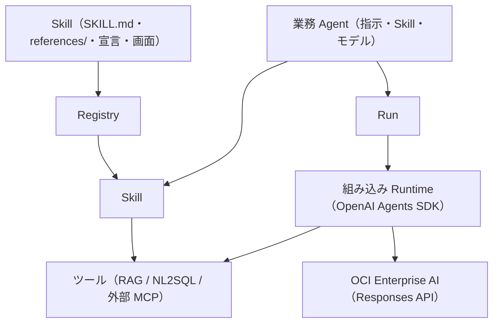

# Agent Platform 設計

## 1. Positioning

業務・業界の Agent を作り、Skill と MCP（RAG・NL2SQL・その他）を安全に使わせる製品。業務 Agent の定義と、
その実行（組み込み Runtime）、共通の Run・Event・Artifact・Approval・Audit を 1 つの製品で持つ。

#754 で、外部の Runtime（OpenClaw / Hermes / DeerFlow）への Binding による配置をやめ、Control Plane の中の
組み込み Runtime（OpenAI Agents SDK + OCI Enterprise AI の Responses API）で実行する形にした。
今後の作り変えは「Agent Platform 再設計案」（2026-10-02）に沿う。


```mermaid
flowchart TD
  K["Skill（SKILL.md・references/・宣言・画面）"] --> R["Registry"]
  R --> S["Skill"]
  S --> T["ツール（RAG / NL2SQL / 外部 MCP）"]
  A["業務 Agent（指示・Skill・モデル）"] --> S
  A --> X["Run"]
  X --> B["組み込み Runtime（OpenAI Agents SDK）"]
  B --> O["OCI Enterprise AI（Responses API）"]
  B --> T
```

## 2. Domain contracts

### Business Agent

`AgentProfile` の正式な編集対象は `name / description / instructions / skill_ids / model_id / data_scopes / enabled`。

データの範囲（`data_scopes`。#1378）: 標準の MCP 接続（`nl2sql` / `rag`）ごとに、使えるプロファイルの ID の一覧と既定
（`AgentDataScope`: `profile_ids` / `default_profile_id`。1 つなら既定はそれ、複数なら一覧の中の 1 つ）を持つ。一覧が空の
接続は「範囲なし」で、今までどおり Run の利用者が使えるすべてのプロファイルからモデルが選ぶ。範囲は版に入る（下書き → 公開）。
保存は Agent と同じく snapshot（`AGENT_RUNTIME_CHECKPOINTS`）で、システムテーブルの DDL は変えない（古い snapshot は空の範囲で
読める）。

- 編集画面の候補は `GET /agent-data-scopes/{接続}/candidates`（Agent 管理）。MCP の `nl2sql_list_profiles` /
  `rag_list_search_answer_profiles` を**編集者**のサービストークン（`sub` = 編集者）で上限の件数まで呼ぶので、編集者が
  使えるものだけが出る。`POST /agents`・`PATCH /agents/{id}` は、範囲に**新しく加えた** ID を同じ一覧で確かめ、
  無ければ 400（`agent_data_scope_forbidden`）、一覧を取れなければ 409 / 502（保存しない）。既に範囲にある ID と範囲を
  外す変更は確かめない（別の編集者が加えた ID を残したまま、ほかの項目を保存できる）。
- 組み込み Runtime の強制（`features/agent/data_scope.py`。tool handler で、モデルの指示に頼らない）:
  - 1 つ: `nl2sql_query` の `profile_id`・`rag_search` / `rag_retrieve_evidence` / `rag_lookup_guides` の
    `search_answer_profile_id` を Runtime が埋め、モデルが渡した値は上書きする。モデルに見せる schema からその引数を除く
    （`tool_registry.invoke` に渡す定義は呼び先の契約のまま）。
  - 複数: 範囲外の値はツールのエラー（`agent_data_scope_violation`。使える ID と既定を返す）で、呼び先へ送らず予算にも
    数えない。値が無ければ Agent の既定（NL2SQL の `"default"` には落とさない）。schema の説明に使える ID を足す。
  - 一覧（`nl2sql_list_profiles` / `rag_list_search_answer_profiles`）は呼び先に上限の件数を求め、範囲で絞ってから
    モデルが求めた件数に切る。推薦（`nl2sql_recommend_profile` / `rag_recommend_search_answer_profile`。#1850）は
    候補の `profile_ids` を範囲で埋め、推薦が範囲外なら `null`、候補も範囲で絞る。
  - RAG で範囲を設定したら `knowledge_base_ids` を使わない（schema から除き、渡されたら外す）。
  - 記録: step の `tool_call.data_scope`（接続・使える ID・使った ID・モデルが求めた ID・`filled` / `overridden` /
    `kept` / `rejected` / `filtered`・使わなかったナレッジベース）と、絞った件数（`tool_result.audit_metadata.data_scope`）。
    承認待ちの呼び出しも、実行するときと同じ（範囲を当てた）引数で承認に出す。モデルへの指示に「データの範囲」の節を足す。
  - Agent の範囲は利用者の権限を広げない（呼び先は Run の利用者の権限で判定する。積で効く）。
  - 推薦（`nl2sql_recommend_profile`）の候補の一覧（`profile_ids`）は Runtime が範囲で埋める（モデルが範囲の中の候補を
    渡していれば、その中に絞る。schema から除く）。
- 呼び先でも強制する（多層の防御。#1379）: Run のツールの呼び出し（回答の最終の検証の `rag_validate_answer` を含む）の
  サービストークンに、その接続の範囲の ID を claim `profile_ids` として入れる（`ToolInvocationContext.profile_scopes`。
  範囲の無い接続・外部の MCP には付けない。`tools/list` には付けない）。RAG / NL2SQL は「利用者の権限 ∩ claim」で判定し、
  範囲外は 403（`PROFILE_SCOPE_FORBIDDEN`）にする（platform の `docs/backend-standard.md`「製品間の連携」）。
- `nl2sql_query` の `profile_id` は MCP の契約で必須（#1379）。範囲の無い Agent でモデルが渡さないときは、呼び先へ送らずに
  ツールのエラー（`agent_profile_required`。`next_tools` に `nl2sql_recommend_profile` / `nl2sql_list_profiles` の
  モデルに渡す名前）で選ぶツールを案内する。

版（#770）: 名前・説明・指示・Skill・モデルは「下書き」で、`POST /agents/{id}/publish` で版（`AgentVersion`: 版の番号・
内容・公開日時・公開者・メモ）を作り、`published_version` にする。通常の Run は公開中の版の内容で実行し
（`RunState.metadata.agent_version`）、公開していない Agent の Run は 409（`agent_unpublished`）。Agent 管理
（admin）は `RunCreateRequest.draft=true` で下書きを試せる（`agent_version="draft"`）。
`POST /agents/{id}/versions/{version}/restore` はその版を公開し直し、下書きもその内容にする（ロールバック）。
画面・API で作る Agent は下書きから始め、#770 より前の Agent（`versioned=false`）は読み込み時に現在の内容を
v1 として公開する。
公開の版は使うスキルの中身（`AgentVersion.skills` の `PinnedSkill`: 名前・説明・指示・MCP のツール・有効・参照文書の
索引と本文の hash・中身の hash `content_hash`）を固定する（#1855）。公開中の版の Run（評価の「公開中の版」を含む）は
固定した中身で動き（`_agent_for_run` が `pinned_skills` を入れ、組み込み Runtime が `use_pinned_skills` /
`resolve_skill` で指示・ツール・参照文書の索引を引く）、下書きの Run は今のスキルで動く。参照文書の本文は固定せず、
今の本文を読む。固定した後に中身が変わった・消えたスキルは `skill_updates` に出し（「スキルが更新されています」）、
公開していない変更に数える（再公開で取り込む）。組み込みのスキル（`skills/<name>/SKILL.md`）も同じく固定する
（配備で更新されたら、評価してから再公開する）。固定していない版（#1855 より前・起動時に作った v1。`skills=None`）は
今のスキルで動き、画面で公開して固定することを案内する。
スキルの更新の取り込み（#1867）: `GET /agents/{id}/skill-updates` が固定したスキルと今のスキルの差（指示の unified diff・
説明・ツール・参照文書）を返す。`POST /agent-skill-updates/publish`（Agent 管理）は選んだ業務 Agent に、公開中の版の項目のまま
スキルの今の中身を固定し直した新しい版を公開する（下書きの変更は公開しない。取り込めない業務 Agent は `skipped` と理由）。
`POST /agent-skill-updates/rollback` は公開中の版だけを前の版に戻す（下書きは変えない。画面は Toast の「取り消す」）。
業務 Agent の `skill_policy`（版の項目）は `pinned`（既定。公開の版に固定）か `latest`（公開中の版でも今のスキルで動き、
更新の印を出さない。開発・検証用）。画面は業務 Agent の一覧の「スキルの更新があります（N 件）」と確かめて選んで再公開する
side sheet、詳細の差分・「スキルの更新だけを公開」・品質評価への導線（`/evaluation?agent=<id>`）。
利用者の Run を作る入口（チャットの選択肢・自動実行の作成と実行）は、
公開した版の無い Agent を出さず・選ばせない（`runtime.agent_unavailable_reason`。#792）。品質評価は下書きでも評価できる。
品質評価（#810）は評価の開始で「公開中の版」か「下書き」を選ぶ（`EvaluationRequest.agent_version`。省略時は公開して
いない変更があれば下書き、なければ公開中の版。公開した版が無ければ下書きだけ）。job は `agent_version`（版の番号か
`"draft"`）を残し、公開中の版は始めたときの版に固定して Run を作る（`create_builtin_run(agent_version=...)`。Run の
`metadata.agent_version` は #770 のまま）。前回との比較は同じ評価セット・同じ評価ケース（質問・期待・期待するツール）の
完了した job とだけ行い、比べた版（`previous_agent_version`）と日時を返す。
評価ケースは期待するツールの順（`expected_tools_in_order`。各ツールの最初の呼び出しの順で比べ、先頭が最初に呼ぶツール）を
任意で持ち、ツールの選択の判定に使う（`tool_order_correct`。#1845）。判定のモデルの応答が出力の上限で止まったら、上限を
広げて（広げられなければ同じ上限で）1 回だけ送り直し、それでも止まれば「判定できなかった」（`judge_failed`）にする。
判定できなかったケースは回答の誤りではないので、合格率の分母から除く（`summary.unjudged`）。
評価セットは評価セットの業務 Agent 以外でも評価できる（`EvaluationRequest.agent_id`。対象範囲・実行できる状態は評価する
業務 Agent で確かめる。#1845）。前回との比較は同じ評価セット・同じ業務 Agent・同じ評価ケースの job だけで、業務 Agent・版を
またいだ比較は `GET /evaluations/compare?base_job_id=&target_job_id=`（同じ質問のケースどうしで並べ、合否で改善・悪化・
変化なし、片方にしか無いケースは `base_only` / `target_only`）。
評価ケースは問い返し（回答前の確認）への答え（`clarification_answers`。共通の `ClarificationCard` の
`{ itemId, optionIds, otherText }` と同じ形の `item_id` / `option_ids` / `other_text`）を任意で持つ。Run が問い返しで
止まったら（支援タスクの状態の `pending_clarifications`）、確認事項ごとに同じ `item_id` の答え、無ければ `item_id` の
空の答えを順に当て、利用者がチャットで答えるのと同じ文を同じ会話（`thread_id`）の次の Run で送る（NL2SQL の
`requirement_session_id`・`answer`、RAG の `conditions` への写しは組み込み Runtime の確認の扱いに任せる）。往復は
2 回まで（`EVALUATION_CLARIFICATION_ROUNDS_MAX`）で、最後の Run の回答を、送った答えを添えて判定する。結果は
`clarification_rounds`（往復ごとの Run・確認事項・答え・送った文）と `ended_with_clarification` に残す。確認事項には
当てた答え（`selected` は選んだ候補の表示名、`other_text`）も残し、ケースの詳細は 1 往復を共通の `ClarificationRecord`
（`variant="disclosure"`。回答前の確認の履歴と同じ表示）で出して、送った文をその下に添える（#1861）。
業種テンプレートから作った Agent は `template_id` を持ち（#810。以前の Agent は空のまま読める）、
`POST /evaluation-sets/from-template` でテンプレートの評価ケースの評価セットを作れる。フィードバック・Run の詳細の
「評価ケースに追加」は `GET /runs/{id}/evaluation-case`（質問・管理者のコメント・呼んだツールの下書き）と
`POST /evaluation-sets/{id}/cases`（同じ質問・50 件の上限は 409。出どころの `source_run_id` を残す）を使う。
MCP、Tool、Runtime を Agent に埋め込まない。`tool_names` は移行リリースの読取互換だけである
（`command_allowed_prefixes` は #756 で削除した）。

### Skill

Skill は AgentSkills 互換の指示本体であり、次の内部依存を持つ。

```json
{
  "id": "business-rag-research",
  "instructions": "...",
  "mcp_requirements": [
    {"server_id": "rag", "tool_names": ["rag_search", "rag_list_search_answer_profiles", "rag_read_source"]}
  ],
  "references": [{"path": "references/guide.md", "characters": 1200}]
}
```

`server_id` は MCP 接続の ID（`control-plane` は Control Plane のツール）。`tool_names` が空なら接続のすべての
ツールを使う。組み込み Runtime は、Agent の選択 Skill が要求するツールの和集合だけをモデルに渡す（指示への列挙だけで
権限を表現せず、渡すツールの一覧を実体として絞る）。

組み込みの Skill と初期の業務 Agent（#1573）:

| Skill の ID | 名前 | 使うツール |
|---|---|---|
| `business-rag-research` | 業務 RAG 調査 | `rag` の検索・読み取り |
| `structured-data-query` | 構造化データ照会 | `nl2sql` の照会・ジョブ・業務プロファイル |
| `rag-and-structured-data` | 資料とデータの横断調査 | `rag_search` と `nl2sql` の照会 |

組み込みの Skill は Agent Skills の形式（agentskills.io）で、repo 直下の `skills/<name>/`（3 製品のどれにも属さない）に
置く（#1816）。Agent は起動時に `skills.register_builtin_skills()` でこのフォルダを読み（コードに指示・説明・ツールを
持たない。正本は `SKILL.md`）、同じフォルダを Claude Code・Codex などの外部の Agent にもそのまま入れる。

- `SKILL.md` の frontmatter は仕様のフィールドだけ: `name`（ID。小文字・数字・ハイフン、フォルダ名と同じ）・
  `description`（何をするか＋いつ使うか。外部の Agent がスキルを選ぶ手がかり）・`compatibility`（要る MCP 接続）・
  `license`。本プロダクトの拡張は `metadata`（文字列 → 文字列）に置く:
  `production-ready-display-name`（画面の名前）・`production-ready-mcp-tools`（`<接続>:<ツール>` の空白区切り。
  `mcp_requirements` になる）・`production-ready-tags`。`AGENT_SKILLS_DIR` のスキルも同じ読み方をする。
- 本文は 500 行以内。目的の文 → `## 使う MCP ツール`（MCP サーバー名と素のツール名。Agent によって前置きが付く）→
  `## 手順` → `## 結果ごとの対応` → `## 回答の書き方` → `## してはいけないこと`。使う見出しだけを置く。長い参照は
  `references/*.md` に出し、本文から 1 段の深さでリンクする（Agent は索引だけを指示に入れ、`skill_reference_read` で
  読ませる）。毎回の手順で要る短い内容は本文に置く（`business-rag-research` の根拠の読み方（約 1,000 字）は参照文書に
  出すと #1816 の評価の 120 Run で 1 度も読まれず、本文の Step 4 に戻した。#1846）。
- 仕様の検証は公式の `skills-ref`（`tests/test_skill_md_spec.py`）。`metadata` のツールが RAG / NL2SQL の MCP の契約
  （`platform/contracts/mcp/`）にあることも確かめる。
- 外部の Agent へ配る形: repo 直下の `.claude-plugin/marketplace.json`（marketplace `production-ready-suite`）が
  `skills/` を plugin `production-ready-skills`（`skills/.claude-plugin/plugin.json`）として載せる。入れ方・MCP の設定
  （名前は `rag` / `nl2sql`、API キー）・つまずく所は [skills/README.md](../../skills/README.md)（#1846 で通しで確かめた
  手順）。配った後にスキルを変えたら `plugin.json` の `version` を上げる。
- 旧 ID（`business_rag_research` など。#1573 の `rag_then_structured_data` も）の保存済みの業務 Agent は、システム
  テーブルの migration `20261014_013_rename_builtin_skill_ids` が新しい ID にする（読み込みで読み替えるコードは持たない）。
- 手順の形は作業に合わせる: `business-rag-research` は順番が意味を持つ多段の質問なので `### Step N:` の一直線の手順
  （各 Step に呼ぶツールと「→ Step N」の行き先）、`rag-and-structured-data` は順序を決めない判断のループ（足りないものを
  判断 → ツールを呼ぶ → 結果を確かめて戻る）、`structured-data-query` は短い番号付きの手順と `status` ごとの対応。
- `business-rag-research` は、元の指示の順（根拠を集める段の決まり → 多段の手順 → 検索の前の確認）を保ち、
  `rag_search` を独立の Step の見出しにしない。実モデル（`openai.gpt-oss-120b`）の比較で、`rag_search` の Step を
  分岐の先に置いた並びでは、多段の質問を `rag_search` から始めて 2 段目を引かない回答が増えた（#1795）。
- ツールの結果の値（`outcome` / `status` / `next_step.action`）→ すること の対応を `## 結果ごとの対応` の箇条書きに
  まとめ、ツール名・フィールド名は `code` にする（組み込み Runtime は `code` の中の素のツール名も
  `<接続>__<ツール>` に書き直す）。
- 規則の文を書き直すときは、前後の規則を突き合わせて意味を落とさない・足さない。スキルの詳細画面は指示を Markdown
  として表示する。

`rag-and-structured-data` は順序を決めない。各ステップで、資料の根拠が要るなら `rag_search`、業務データの値が要るなら
`nl2sql_query` を選び、一方の結果で分かった事実・条件・識別子で、もう一方や同じツールを繰り返し呼ぶ。根拠がそろったら
止める。旧 ID `rag_then_structured_data`（RAG の後に NL2SQL の固定の順序）は、保存済みの業務 Agent とその版の
読み込みで新しい ID に置き換える（`skills.RENAMED_SKILL_IDS`）。

| 業務 Agent の ID | 名前 | Skill |
|---|---|---|
| `default`（既定） | 資料・データ横断アシスタント | `rag-and-structured-data`・`business-rag-research`・`structured-data-query` |
| `rag-research` | 資料調査アシスタント | `business-rag-research` |
| `data-query` | データ照会アシスタント | `structured-data-query` |

3 つは builtin（`runtime.BUILTIN_AGENT_IDS`）で、削除できず、保存済みの snapshot に無ければ読み込みで足す（v1 を公開した
状態）。#1573 より前の `default`（名前が「汎用業務 Agent」のまま）は、新しい内容を次の版として公開する（前の版は残す。
名前を変えた `default` は利用者の内容として残し、Skill の ID だけを置き換える）。

### Skill の参照文書（#862 / #1803）

Agent はプラグインを持たず、スキルだけを持つ（#1798 でマーケットプレイス、#1803 でプラグインを削除）。
スキルは Agent Skills の形（ディレクトリ + `SKILL.md`）で、`AGENT_SKILLS_DIR/<id>/SKILL.md` と同じディレクトリの
`references/**` のテキスト / Markdown（`.md` / `.markdown` / `.txt`）を参照文書（`references`）として読む
（`skills_loader.load_skill_references`）。

- symlink（ファイル・ディレクトリ・`references/` 自体）は辿らず、解決したパスが `references/` の外なら読まない。
- 上限は 1 スキルで 100 ファイル・1 ファイル 1 MiB・合計 4 MiB。超えた分は読まずに warning を出す。
- `scripts/` などの同梱のコード・その他のファイルは読まない・実行しない。
- API の応答・保存にはパスと文字数だけを出す（本文は `exclude`）。
- 組み込み Runtime は本文を指示へ詰めず、パスの索引だけを入れ、その Skill を割り当てた Run にだけ
  `skill_reference_read`（`skill_id`・`path`・`offset`）を渡して 8,000 文字ずつ読ませる。読み取りも
  `tool_registry.invoke` のポリシー・監査を通す。
- 画面・API・`AGENT_SKILLS_DEFINITIONS_JSON` で作るスキルは参照文書を持たない。

### 組み込み Runtime（#754）

- `features/agent/builtin_runtime.py`。SDK は `openai-agents`（`pyproject.toml` で版を固定）。
- モデル: Agent の `model_id`（空なら「システム設定 > モデル」の既定のテキストモデル）と、その接続（Endpoint・API key・
  Project OCID）。`OpenAIResponsesModel` に OCI の OpenAI 互換の base URL を渡す。xAI のモデルは空の `tools` を
  拒否するため、ツールが無い呼び出しでは `tools` / `tool_choice` を送らない（`OciResponsesModel`）。
- 指示: 共通の前置き（日本語・根拠・推測しない）＋ Agent の指示 ＋ 割り当てた Skill の指示。
  Skill の指示は MCP のツールを素の名前（`rag_search`）で書いてよい。Run を作るときに、Skill の requirement が
  名前で宣言し、この Run でモデルに渡すツールの名前（`rag__rag_search`）へ書き直す（Agent の指示・支援タスクの指示も同じ。
  同じ素の名前が複数の接続にあって 1 つに決まらないものは書き換えない。#1303）。
- 無いツールの呼び出し: モデルが渡していない名前のツールを呼んでも Run を落とさない（SDK の
  `tool_not_found_behavior="return_error_to_model"`）。モデルへは「呼ぶときの名前は `<接続>__<ツール>`」
  （候補が複数なら候補の一覧）を返して呼び直させる。Control Plane が素の名前を別のツールへ読み替えて実行することは
  しない（呼び出し・承認・監査はモデルが呼んだ名前のまま。#1303）。
- ツール: Skill の requirement が要求するツールを `FunctionTool` にする。`control-plane` は `tool_registry` の
  ツール、それ以外は MCP 接続の `tools/list`（Run の利用者として取得。名前は `<接続>__<ツール>`、英数字・`_`・`-`
  で 64 文字以内）。取得できない接続は飛ばして Run に `runtime.event`（warning）を残す（#757）。
  実行は `tool_registry.invoke`（ポリシー・ガードレール・監査・成果物、サービストークン）。
  ポリシーの「拒否」は渡さず、「承認」は `needs_approval=True`（MCP のツールは `readOnlyHint` が無ければ既定で承認）。
- 承認: SDK の中断（`result.interruptions`）で承認待ちの step と ApprovalRequest を作り、`result.to_state().to_string()`
  を Run の metadata（`_builtin_sdk_state`）に保存して `waiting_approval` にする。すべて決まると `queued` に戻り、
  状態を復元して承認・却下を反映し再開する。承認済みのツールは中断時の step を実行中にして結果を記録する。
  無人の Run は承認待ちにしない（`_unattended_approvals`）: 品質評価の Run（`evaluation_dry_run`。#776）は承認が要る
  ツールを実行せずに dry-run の step を残し、自動実行の Run（`metadata.automation_id`。スケジュールも今すぐ実行も。#1813）は
  承認が要るツールを呼ばない（無人の実行は事前に許可したツールだけを使う）。どちらも SDK の却下（`rejection_message`）で
  モデルへ理由を返して回答まで続ける。自動実行では「自動実行では承認の要るツール（名前）を使えません。管理者がツールの
  ポリシーで許可すると使えます。」を返し、取り消しの step（`error_code=automation.approval_required`、監査ログに出る）と
  Run の経過のイベント（warning）を残す。自動実行の編集画面は `GET /api/automations/agents/{agent_id}/approval-tools`
  （公開中の版のスキルのツールを Run と同じ `ToolPolicy.decide` で判定）で使えないツールを警告する。
  `_` で始まる key と Control Plane の予約の key（`RESERVED_RUN_METADATA_KEYS`。評価・自動実行・MCP・再実行の印）は、
  利用者が `POST /api/runs` の `metadata` で付けると 422 にする（再開の状態や出所を偽らせない。#1130）。
- tracing: `set_tracing_disabled(True)`（業務データを外部へ送らない）。
- テスト: SDK の `agents.testing.ScriptedModel` でモデルを台本にする（`tests/test_builtin_runtime.py`）。

### RunState

共通 Run は状態/Event/Artifact/Approval/Audit と `runtime_id`（新しい Run は `builtin`）を持つ。
`POST /api/runs` は `agent_id` と `goal` だけを受け取り、組み込み Runtime で実行する。モデルの最終回答は
`kind="answer"` の Artifact に残す。

## 3. ツールとポリシー

Control Plane のツール（`echo` / `agent_skill_list`）は `tool_registry` に登録する。MCP 接続のツールは登録せず、
Run ごとに `tools/list` から作ったツール定義を `tool_registry.invoke` に渡し、ToolPolicy、PII/secret masking、
audit metadata、成果物の保存を再利用する（#757）。外部 Runtime 向けの Binding MCP（`/api/mcp/{binding_id}`）
と adapter 契約（`probe_capabilities / sync_binding / submit_run / ...`）は #754 で削除した。

## 4. 製品の MCP

### 4.1 MCP 接続（RAG / NL2SQL / 外部 MCP。#233 / #757）

RAG / NL2SQL / 外部 MCP は「MCP 接続」（`config.McpConnectionConfig`、API `/api/settings/mcp-connections`）で
管理する。RAG / NL2SQL は標準の接続 `rag` / `nl2sql`（各製品の `POST /api/mcp`。認証はサービストークン、
aud は製品名。削除できない）。表示名は「ナレッジ検索（RAG）」「データ問い合わせ（NL2SQL）」で変えられない（#1325）。
URL は `AGENT_EXTERNAL_RAG_MCP_URL` / `AGENT_EXTERNAL_NL2SQL_MCP_URL` で、配備がこれを与えた接続は `base_url_locked`
になり、画面・API で URL を変えられない（PATCH は 400。保存した URL・名前は起動時の復元でも使わない）。環境変数が空の
構成（ローカルの開発・その製品を配備しない構成）だけ、画面で URL を設定して保存できる。外部の MCP は画面・`AGENT_EXTERNAL_MCP_SERVERS_JSON` で追加し、
認証方式は なし / API キー / OAuth client credentials / サービストークン。ツールは呼び先の契約（RAG / NL2SQL は
`platform/contracts/mcp/`）をそのまま使い、Agent は引数を作り変えない。

| ツール（モデルに渡す名前） | readOnlyHint | 既定の policy |
|---|---|---|
| `rag__rag_search` / `rag__rag_list_search_answer_profiles` / `rag__rag_read_source` | true | 承認なし（`rag_search` は回答生成に LLM を使う） |
| `nl2sql__nl2sql_list_profiles` / `nl2sql__nl2sql_recommend_profile` / `nl2sql__nl2sql_get_job` | true | 承認なし |
| `nl2sql__nl2sql_query` | false | 承認なし（#1832。標準の接続の既定。呼び先は SELECT だけを実行し、見える範囲は業務プロファイル・Deep Data Security・利用者の権限で決まる。ツール権限で ask にすれば承認を求める） |
| `nl2sql__nl2sql_cancel_requirement` | false | 承認が必要 |

RAG のチャットは MCP で提供しない（#787）。RAG の MCP は検索（`rag_search`）・根拠の読み取り（`rag_read_source`）・
検索・回答プロファイルの一覧だけを持つ。`rag_search` の根拠は `evidence[]`（場所 `locator` の節・頁、版 `chunk_set_id` /
`recipe_id`、回答に使ったか `used_in_answer`、切り詰めの有無 `truncated`）で返し、回答に使った根拠を先にして `evidence_limit`
件まで返す。切り詰めた本文と親の本文は `rag_read_source`（検索と同じ見え方の条件。見えない根拠は `source_not_found`、古い版は
`source_stale`）で読む（#1219）。チャットの出典は回答に使った根拠だけを、場所を添えて出す。

ツール権限（`/settings/tool-policy`）は `<接続>__<ツール>` の名前で allow / ask / deny を上書きできる。
画面の一覧は `GET /api/settings/tool-policy/tools`（#1814。`tool_policy_catalog`）で、組み込みのツールに、URL を設定した
MCP 接続の `tools/list`（ログイン中の利用者として取る）を足し、「既定に従う」の判定（Run と同じ `ToolPolicy.decide`）を
添える。取れない接続は理由を出し、その接続のツールで保存したポリシーは「一覧にありません」の行として残す（保存し直しても
消さない）。各行に判定の理由（ツール権限で指定 / 標準の接続の既定 / 読み取り専用 / 注釈を信頼しない接続 / 既定の動作）を出す。

既定の判定（`ToolPolicy.explain`。#1832）は、ツール権限の個別の指定（deny → ask → allow）→ 標準の接続で Agent が承認なしと
決めたツール（`STANDARD_AUTO_APPROVED_TOOLS`。今は `nl2sql_query` だけ）→ 読み取り専用（Control Plane のツールの宣言、MCP の
ツールは注釈を信頼する接続の `readOnlyHint=true`）→ 未指定ツールの既定動作（承認を要求 / 拒否）の順。MCP 接続の
「ツールの注釈（readOnlyHint）を信頼する」（`trust_tool_annotations`）は、外部の接続（画面・API で追加した接続と
`AGENT_EXTERNAL_MCP_SERVERS_JSON` の宣言）では既定でオフ（#1875。新しい接続も、保存した値の無い既存の接続もオフ。
未リリースのため互換は持たない）。MCP の仕様は注釈を呼び先の自己申告とし、信頼しないサーバーの注釈を untrusted として
判断に使わないよう求めるため、オフの接続の `readOnlyHint=true` のツールは既定の動作（承認を要求 / 拒否）になる。管理者が
接続先とツールを確かめてから接続の画面でオンにし、オンにするときは確認のダイアログで「注釈を信頼すると、読み取り専用と申告した
ツールが承認なしで動く」ことを示す（オフに戻すのは確かめない）。標準の接続（RAG / NL2SQL）は Agent がツールの性質を知って
いるので常に使う（オフにできない）。`nl2sql_query` の `readOnlyHint` は false のまま（ジョブを作るので送信後の失敗では再送しない）。
既存の環境で `nl2sql__nl2sql_query` をツール権限の ask に入れていれば、その指定が優先する（消さない）。

承認の画面の「承認して今後は自動で実行」（#1832）は、その呼び出しを承認し、ツール権限でそのツールを allow にする（ask
から外す）。すべての業務 Agent・利用者の実行に効くので、確認のダイアログで示す。押せるのはツール権限を変えられる Agent 管理
（`agent.admin`）だけ（ほかは 403）。Run のイベント（`approval.decided` の `always_allow=true`）とログ
`agent_tool_policy_always_allow` に残す。同じ Run の再開から新しいポリシーで実行する。
NL2SQL の SQL に書き込みの文があれば `nl2sql.non_readonly_sql_returned_as_audit_only` の警告を残す（実行はしない）。

- **利用者**: Run の作成時に、ログイン中の利用者（Cookie のセッション。local mode ではローカル利用者）の
  `user_uuid` を `RunState.created_by_user_uuid` に記録する（checkpoint の JSON に入る。項目がない既存の Run は
  None）。Run からのツール呼び出し
  （承認後の再実行を含む）は `ToolInvocationContext.user_uuid` / `run_id` にこの値を入れるため、承認者ではなく
  Run を作った利用者として呼ぶ。再実行（replay）の Run は、再実行を指示した利用者になる。単発の
  `POST /tools/invoke` と画面の「ツールを取得」（`GET /settings/mcp-connections/{id}/tools`）は、ログイン中の利用者として呼ぶ。
- **token**（サービストークンの接続）: 呼び出しごとに `issue_service_token(PLATFORM_SERVICE_TOKEN_SECRET, subject=<Run の利用者 or
  サービス利用者>, audience=<接続の audience>, issuer="agent", claims={"run_id", "agent_id"})`（HS256、60 秒）を
  作り、`Authorization: Bearer` で送る。署名鍵は 3 製品の共通 `.env` で同じ値にする（32 文字以上。未設定なら
  `mcp.service_token_not_configured`）。サービス利用者の login ID → `user_uuid` は共通認証の store で解決し、
  プロセス内にキャッシュする。
- **MCP の手順**: 呼び出しごとに `initialize`（`2025-06-18`）→ `notifications/initialized` → `tools/call`。
  応答の `Mcp-Session-Id` を以降の request に付け、`Accept: application/json, text/event-stream` と
  `MCP-Protocol-Version` を送る。結果は `structuredContent`（無ければ text の `content`）、`isError: true` は
  `mcp.tool_error`（呼び先の `error_code` / `message` / `status` を `error_details` に入れる）。SSE の途中経過と
  paging は扱わない。すべての接続が同じ client（`McpConnectionClient`）を使う。固定の session id を設定した接続には
  `initialize` を送らず、`initialize` を持たない接続（`-32601`）はそのまま `tools/*` を呼ぶ。
- **再試行と期限（#854）**: 1 メッセージを `AGENT_EXTERNAL_MCP_MAX_RETRIES`（既定 3）回まで再試行する。分類は MCP の意味に合わせる。

  | 失敗 | 手順（`initialize`・`notifications/initialized`・`tools/list`） | 読み取り専用（`readOnlyHint=true`）の `tools/call` | それ以外の `tools/call` |
  |---|---|---|---|
  | 送信前（`ConnectError`・`ConnectTimeout`・`PoolTimeout`）・429・503 | 再試行 | 再試行 | 再試行 |
  | 502・504・通信の途中の切断 | 再試行 | 再試行 | しない |
  | 500・読み取りの timeout | 再試行 | しない | しない |

  書き込みのツール（`nl2sql_query` など）は、呼び先に届いた可能性がある失敗では再送しない（SQL の実行・LLM の呼び出しを
  重複させない）。読み取り専用のツールも、読み取りの timeout は再送しない（`rag_search` のように呼び先で LLM が動いている）。
  待ちは 0.5 秒から 2 倍ずつ（上限 8 秒、後半を jitter）、429 / 503 の `Retry-After`（秒・HTTP 日付）があればその値（上限 30 秒）。
  1 回のツールの呼び出し（`initialize` から `tools/call` まで）全体を接続の timeout で区切り、各 POST の timeout は残りの時間
  （接続の確立は 10 秒以下）、待つと期限まで 1 秒を切るときは再試行しない。待ちは `tools._retry_sleep` で差し替える（テストは
  待たない）。最後の失敗は利用者の言葉のメッセージ（例:「MCP 接続「RAG」に接続できません（RAG のサービスが起動しているか、
  接続の URL が正しいかを確認してください）。」）と code（送信前の失敗 `mcp.unreachable`、ほか `mcp.timeout` / `mcp.http_error` /
  `mcp.request_error`。`error_details` に `attempts`・`retryable`）のツールの失敗としてモデルへ返し、Run は続く（モデルが
  利用者に伝える）。ツールの一覧が取れない接続は従来どおり飛ばして warning を残す。
- **NL2SQL のジョブの完了を待つ（#848）**: 組み込みの接続 `nl2sql` の `nl2sql_query` / `nl2sql_get_job` の結果が
  `pending` / `running`（`job_id` あり）なら、ツールの handler の中で `nl2sql_get_job` を `wait_seconds`（最大 20 秒。
  接続の timeout から 15 秒引いた値以下）付きで繰り返し呼び、完了した結果をモデルに返す。待つ合計の上限は
  `AGENT_NL2SQL_JOB_WAIT_SECONDS`（既定 300 秒、0 で待たない）で、1 回の待ちごとに Run がキャンセル・終了していないかを
  確かめる。上限を超えた・Run が終わった・続きの取得に失敗したときは最後の結果（`running` と `job_id`）を返す。
  SDK の function tool の timeout は待つ分を足した値にする。外部の MCP 接続のツールは対象外。
- **NL2SQL の SQL の生成前の確認（#1441）**: `nl2sql_query` は SQL の生成前の確認（NL2SQL の SQL 生成の画面の回答前の確認と同じ session）で
  要件を確かめ、足りない・明確でない情報があれば SQL を作らずに `status=needs_clarification` と `requirement.question`
  （質問・候補・理由。表・列は物理名）を 1 つだけ返す。Agent はモデルへの結果に `next_step`（`ask_clarification`。RAG の確認と
  同じ形）を足し、確かめ中の問い（`kind=nl2sql`・`requirement_session_id`・候補）を支援タスクの状態に残す。利用者が答えた次の Run は、
  指示の「データベース（NL2SQL）の確かめ中の問い」に従い `requirement_session_id` と `answer` を付けて呼び直す。確認の要るものが
  無くなり SELECT・FROM が明確になると、NL2SQL が要件を反映してジョブで SQL を作る（確認が要らなければ聞かずに進む）。
  Agent のチャットに「SQL の生成前の確認」のボタンは置かない。回答の対応は `needs_clarification`（`basis=nl2sql_clarification`）。
- **確認の取り消し（#1441・#1445）**: 確かめ中の確認（NL2SQL の SQL の生成前の確認・RAG の `needs_clarification` / 業務ガイドの clarify）は、
  チャットの「データベースの検索は不要」「資料の検索は不要」（`POST /api/runs` の `clarification_cancel`。同じ部品）か、確かめ中の問いへの
  取り消しの文（「データベースは関係ない」「資料は関係ない」「確認はやめて」など。`clarification_cancel.message_cancel_kinds` の
  決定的な判定）で取り消せる。取り消した Run は、その種類のツール（`nl2sql_*` / `rag_*`）をモデルに渡さず、ほかの手段で続けるか
  意図を聞き直す指示を足す。NL2SQL は Control Plane が `nl2sql_cancel_requirement` で session を閉じる（step に残し、予算に数えない）。
  RAG を取り消した回答は資料と照らし合わせない（`answer_validation` の `skipped` / `rag_declined`）。記録は Run の metadata
  `clarification_cancel`・イベント・支援タスクの状態の `clarification_cancellations` に同じ形
  （`{kind, trigger, run_id, at, questions, requirement_sessions}`）で残す。
- **回答前の確認（#1839）**: 3 製品共通の UX 契約（`platform/docs/ux-contracts/confirm-before-answer.md`）と部品
  （`ClarificationCard` / `ClarificationRecord`）で、Agent の確認を 2 つの出所から出す（実装は `features/agent/confirmation.py`）。
  - **ツールの結果の確認**（NL2SQL の SQL の生成前の確認・RAG の `needs_clarification` / 業務ガイドの clarify）: 確認事項・選択肢は呼び先が
    作ったまま受け渡す（Agent で二重に定義しない）。この Run で新しく確かめ中になった問いを、完了した Run の `confirmations`
    （`source=nl2sql` / `rag`）に出す。答え・スキップ（`POST /api/runs/{run_id}/confirmations/{confirmation_id}`。Run を作った利用者
    だけ）で同じ会話に次の Run を作り、metadata `clarification_response`（確認事項・選んだ選択肢の名前と ID・自由入力）と
    `clarification_round` を残す。次の Run の指示に答えを構造化して渡す（NL2SQL は `nl2sql_query` の `requirement_session_id` と
    `answer` の引数、RAG は `rag_search` の `conditions`。RAG の答えは支援タスクの分かっている条件にも `user_answer` で入れる）。
    「確認せずに回答」は前提を示して答える指示を渡し、NL2SQL の確認なら `nl2sql_query` を `requirement_session_id` と
    `skip_clarification: true` で呼び直させる（NL2SQL が確認せずに SQL を作り、`requirement.status=skipped`）。会話に残す記録は
    `outcome=skipped`。会話が先へ進んだら、答えていない確認は `expired` にする。
  - **Agent 自身の確認**（Control Plane のツール `ask_user_confirmation`。引数 `question`・`reason`・`options[{label, description}]`
    （2〜8 個）・`multiple`。「その他（自由入力）」は画面が必ず出す）: SDK の `needs_approval`（呼び出しごとの判定）で中断し、Run を
    `waiting_confirmation`（確認待ち）にして SDK の状態を保存する（承認待ちと同じ仕組み。承認と同時に中断したら承認待ち）。答え・
    スキップで `queued` に戻し、同じ Run を再開する（確認のツールは実行され、結果が利用者の答え `status=answered`（`selected`・
    `other_text`）か `status=skipped`（前提を示して答える指示））。処理の段階は `confirmation_wait`（kind `confirmation`）。
  - **やめる**: 確認を出した Run と、同じ質問の確認の往復の Run に metadata `clarification_withdrawn` を付けて会話・履歴・支援タスクの
    状態から外し、最初の質問を返す（画面が入力欄に戻す）。Agent 自身の確認で待っている Run は取り消し、NL2SQL の session は
    `nl2sql_cancel_requirement` で閉じる。
  - **業務 Agent の方針**（`clarification_policy`: `confirm` = 確認してから回答する（既定）/ `assume` = 前提を示して回答する、
    `clarification_max_rounds`: 確認の上限（往復。0 は既定の 2 回、2〜6。NL2SQL の業務プロファイルと同じ））: 確認できる Run にだけ `ask_user_confirmation` を渡す。前提を示す
    Run（方針が `assume`・上限に達した・「確認せずに回答」の次の Run・無人の Run（品質評価・自動実行））は、ツールを渡さず、RAG の
    確認の次の手を `answer_with_assumptions`（聞き返さずに前提を示す）に変え、RAG の確認のカードを出さない。往復は、答えで作った
    Run の始めの `clarification_round` と、その Run の Agent 自身の確認の数で数える。
- **設定**: `AGENT_EXTERNAL_RAG_MCP_URL` / `AGENT_EXTERNAL_NL2SQL_MCP_URL`（例 `http://rag-host/api/mcp`）、
  `AGENT_EXTERNAL_RAG_TIMEOUT_SECONDS`（既定 630 秒。`rag_search` は RAG の回答生成（`RAG_ANSWER_TIMEOUT_SECONDS`、既定 600 秒）
  を通しで待つため、それに HTTP の往復の余裕 30 秒を足す。#1425）/ `AGENT_EXTERNAL_NL2SQL_TIMEOUT_SECONDS`（既定 300 秒。NL2SQL の
  `nl2sql_query` / `nl2sql_get_job` は SQL の生成・実行をジョブにし、1 回の呼び出しでは結果を最大 45 秒（`wait_seconds`）だけ待って
  job_id を返す。`nl2sql_query` は SQL の生成前の確認〔LLM。下書きと回答の後の再検査で最大 2 回。#1441〕を呼び、その分だけ
  ジョブを待つ秒数を減らす。45 秒と SQL の生成前の確認の 180 秒に、HTTP の往復・ジョブの登録・DB の負荷の余裕 75 秒を足した 300 秒にする
  〔#1432 の 120 秒に SQL の生成前の確認の分を足した〕。続きの `nl2sql_get_job` は 1 回 20 秒まで待つ。
  ジョブの完了は `AGENT_NL2SQL_JOB_WAIT_SECONDS` まで待つ。SQL の生成の方式は業務プロファイルの既定の生成方式〔#1524〕で、既定の SQL の生成〔Select AI の 1 回〕と実行は NL2SQL の DB の呼び出しの
  上限〔120 秒〕で打ち切られる。#1430）は接続 `rag` / `nl2sql` の初期値（タイムアウト秒の上限は 900 秒。SDK の function tool の
  timeout は、接続の timeout〔`nl2sql` はジョブを待つ分を足した値〕の 2 倍）。`backend/.env.example` は両方の値を明示する（#1430）。画面で保存済みの接続はその値のまま（#1425 より前に保存した `rag` の 60 秒は、
  画面の「MCP 接続」で 630 秒に直す）。画面の「MCP 接続」で URL・タイムアウトを変更でき（保存先に残り、.env の値より優先する。#764）、署名鍵と
  サービス利用者は設定済みかどうかだけを表示する。旧「外部 MCP」の単一の設定（`AGENT_EXTERNAL_MCP_BASE_URL` 等）・
  既定のサーバー・NL2SQL の既定取得件数（`AGENT_EXTERNAL_NL2SQL_DEFAULT_LIMIT`）は #757 で削除した。
- **RAG の図の根拠を画面で開く（#1311）**: チャットの出典・実行の詳細の根拠のうち、RAG の `rag_search` の根拠に
  `image_ref` がある図は「図を開く」を出す。押すと `GET /api/runs/{run_id}/figure-url`（実行の詳細と同じ権限・対象範囲）が、
  Run の `rag_evidence` の成果物にその図があることを確かめてから、組み込みの接続 `rag` の `rag_read_source` を
  `include_image_url=true` で呼ぶ。サービストークンの `sub` は **画面を見ている利用者**（Run を見られる管理者が Run の
  利用者の権限を借りないように）、claim に `purpose=figure_url` を入れる（RAG はこの印の無い呼び出し、つまり Run の中で
  モデルが呼んだときは URL を作らない）。画面の操作で Run のツール呼び出しではないので `tool_registry` を通さず、
  URL（トークンを含む）は保存・ログに残さない（応答も `Cache-Control: private, no-store`）。RAG は利用者・chunk・版に
  縛った 5 分の HMAC 署名の URL（`GET /api/figures/{token}`）を返し、読むたびに権限・版を確かめ直す。ブラウザから
  開く起点は `AGENT_EXTERNAL_RAG_PUBLIC_URL`（空なら RAG が返す URL。MCP の URL の host）で、画面は開くたびに
  URL を取り直し、画像を読めなければ（期限切れ・資料の更新・権限）取り直しの操作を出す。

## 5. Dispatcher and persistence

開発時は API のプロセスで実行する（`AGENT_RUNTIME_DISPATCH_MODE=in_process`。asyncio の task）。本番で別プロセスに
する場合は `runtime-dispatcher`（`python -m app.features.agent.runtime_dispatcher`）が Oracle checkpoint row を
`SELECT ... FOR UPDATE` し、queued の組み込み Runtime の Run に期限付き lease を付けて claim し、実行・再開する。
実行を始めたら lease を外す（承認の決定で queued に戻った Run を、すぐ claim できるようにする）。別 queue 製品は追加しない。

外部 dispatcher は `AGENT_RUNTIME_REPOSITORY_BACKEND=oracle_checkpoint|oracle_normalized` が前提。
memory backend は process 間共有されないため production dispatcher に使用しない。

### 5.1 保存先（#764）

保存先は `AGENT_RUNTIME_REPOSITORY_BACKEND`（既定 `auto`。#839）。`auto` は起動時に 1 回だけ、共通の `PLATFORM_ORACLE_*` の
設定がそろっていれば `oracle_checkpoint`、無ければ `memory` に決め（`app/features/agent/storage_backend.py`）、Run の repository・
定義の store・Run の事実が同じ決定に従う。Oracle に接続できない（接続のエラー）ときも memory に縮退せず、backend は起動して
接続できた時点で読み込む（#1212。§5.1.1）。今の保存先は `GET /api/runtime/storage`（`backend`・
`persistent`・`database_configured`・`reason`。接続先は返さない。#839）で分かり、「運用設定 > 実行環境」の「保存先」の
カードが `StatusBadge` と直し方を出す。保存していない（`persistent=false`）ときは、業務 Agent・スキル・
実行履歴・自動実行・品質評価・MCP 接続・ツール権限・バックアップと復元・システムテーブルの
画面の先頭に warning の Banner（`NonPersistentStorageNotice`）を出し、実行環境へ案内する。理由は、DB の設定がそろって
いれば `memory_backend`（memory などを明示。保存先の設定を直す）か `restart_required`（`auto` で起動時は DB が未設定だった。
再起動する）、そろっていなければ `database_not_configured`（DB の設定から直す）。`auto` で保存済みの checkpoint 全体が読めず memory で
起動したときは `checkpoint_invalid`（#853。§5.1.1）。

| 対象 | memory | file | oracle_checkpoint / oracle_normalized |
|---|---|---|---|
| Run・業務 Agent | プロセス内 | `AGENT_RUNTIME_SNAPSHOT_PATH` の JSON | `AGENT_RUNTIME_CHECKPOINTS`（snapshot の CLOB）。normalized は監査用の `AGENT_RUNTIME_RUNS/EVENTS/STEPS/APPROVALS/ARTIFACTS` も書く |
| 画面・API で変えた定義（Skill・MCP 接続・ツール権限） | 保存しない | snapshot の隣の `<名前>.control-plane.json` | `AGENT_CONTROL_PLANE_ITEMS`（`ITEM_KIND` × `ITEM_ID` の JSON） |
| 利用状況・フィードバックの集計に使う Run の事実（#794） | 保存しない（メモリの Run をその場で集計） | 保存しない（同左） | `AGENT_RUN_FACTS`（1 Run = 1 行。SQL で集計） |

- Oracle は共通の `PLATFORM_ORACLE_*` で接続する（旧 `AGENT_RUNTIME_ORACLE_*` は読まない）。テーブルはシステムテーブル
  （`app.system_schema` の migration 006）が作り、アプリは DDL を実行しない。テーブルが無いあいだは空の状態で起動し、
  定義の保存は「システムテーブルで作成・更新してください」で断る。全再作成はこれらのテーブルも消す（Run の履歴も消える）。
- 定義は API の変更の後に保存し（`control_plane_store.save_*`）、保存先の読み込み（`storage_bootstrap`。§5.1.1）で
  `restore_control_plane()` を呼び、`.env` の宣言の後に重ねる。RAG / NL2SQL の接続は画面で変えた URL・タイムアウトだけを
  上書きする（認証方式は変えない）。`.env` の宣言・組み込みの定義は保存しない。
- 保存済みのデータを書き換える migration（`MigrationArtifact.rewrites`。例: 013 の組み込みのスキルの ID の改名は
  `AGENT_RUNTIME_CHECKPOINTS`、008〜011 は `AGENT_CONTROL_PLANE_ITEMS`）と全再作成は、`storage_bootstrap.rewrite_saved_data`
  で包む（#1844）。書き換えの間は Run の repository の lock を持って変更・保存を待たせ（Run・業務 Agent）、定義の保存は
  `ControlPlaneStoreError`（API は 503「システムテーブルを更新しています…」）で断る。書き換えの後に、同じプロセスの
  Run の repository を checkpoint から、定義の registry（スキル・MCP 接続・ツール権限・自動実行・品質評価）を保存先から
  読み直し、保存先から消えた定義はメモリからも消す（実行中の評価の job はメモリの値を残す）。読み直しの間の保存が
  古いメモリの値で migration の結果を上書きしないため。
  - 別のプロセスのメモリは読み直せないので、結果の `restart_required`（画面は「作成・更新」の直下の warning の Banner）で
    再起動を求める: `AGENT_RUNTIME_DISPATCH_MODE` が `in_process` でなければ dispatcher、読み直しに失敗したら backend。
    CLI（`agent_system_schema --initialize`）は別のプロセスなので、書き換えたら（出力の `rewritten_saved_data`）動いている
    backend の再起動を出力で求める（配備の `init_script.sh` は CLI の後に backend を再起動する）。
- MCP 接続の API キー・OAuth の client secret・セッション ID は、`PLATFORM_SERVICE_TOKEN_SECRET` から HKDF-SHA256 で
  導いた鍵の Fernet で暗号化して保存する（`app.secret_box`。`enc:v1:...`）。署名鍵を変えると復号できないため、その接続の
  秘密は画面で入れ直す。署名鍵が無いと秘密を含む接続は保存できない（503）。
  - #1101 より前に平文で保存した行も読める（`enc:v1:` で始まらない値は平文として扱う）。起動時の復元で平文の秘密を
    見つけたら、その行を暗号化して保存し直す（暗号化済みの値は作り直さない。署名鍵が無い・保存できないときは平文のまま
    読み続け、起動は止めない）。
- 1 worker・`in_process` の前提は変えない（checkpoint は process 内の状態を丸ごと書くため）。

### 5.1.1 保存先の読み込みと再試行（#853 / #1212）

DB に接続できないあいだも backend は起動する（RAG / NL2SQL と同じ。#1212）。Run の repository は module の import 時に
作らず（`runtime.runtime_repository` は遅延の参照。`get_runtime_repository()`）、`app.features.agent.storage_bootstrap` が
Run の repository → 定義の復元 → 履歴の準備（評価の整理・Run の事実の backfill）の順に 1 回だけ読み込む。

- 起動時（lifespan）はバックグラウンド（daemon thread）で読み込みを始め、済むまで 15 秒ごとに再試行する（ログ
  `agent_storage_not_ready`。済んだらログ `agent_storage_ready`）。自動実行のスケジューラは読み込みが済むまで判定しない。
- 業務の API は、読み込みが済むまで最初の要求で読み込みを試み（`app.api.router.require_agent_storage`。認証の前）、
  読み込めなければ 503（`error_code=agent_storage_unavailable`、`Retry-After: 15`）。
  DB の状態・システム設定（データベース・システムテーブル・モデル・OCI・アップロード保存先）・認証・ユーザーとロールの API は待たない。
  画面は DB ゲートで案内し、DB に接続できるようになれば再起動せずに読み込む。
- DB に接続できない（`is_oracle_connection_error`）ときは memory に縮退しない（`AgentRuntimeStorageUnavailableError`）。
  済んだ段階は持ち越す。失敗の直後 5 秒は接続を試さずに同じ理由を返す（wallet の接続記述子の `retry_count` /
  `retry_delay` で 1 回の接続に 1 分以上かかることがあるため、要求ごとに接続を待たない）。別のスレッドが読み込んで
  いるあいだの要求は 10 秒まで待ち、超えたら 503。
- 定義の読み込みの接続以外の障害（権限など）は記録して先へ進む。Run の repository の接続以外の障害（明示した Oracle の
  checkpoint の破損・SQL・権限）は 503 で返す（checkpoint の破損は直し方の文、それ以外はログ `agent_storage_load_failed`
  への案内）。
- runtime-dispatcher（別 process）は最初の claim で repository を作り、作れなければ下の backoff で続ける。

保存先の 1 件の不整合で読み込みを止めない。読み込み（Oracle の checkpoint・file の snapshot・
dispatcher の claim）は `runtime.load_snapshot_tolerant` で、snapshot を JSON として読み、Run・業務 Agent を 1 件ずつ検証する。

- **直す**（`_repair_run`。待ちを終わらせる方向だけで、承認・再開の方向には直さない）: 終わった Run に残った pending の承認 →
  `cancelled`（`decided_by="system:storage-repair"`、承認待ちの step も `cancelled`）、承認待ちなのに pending の承認が無い Run →
  `failed`（`runtime.inconsistent_state`）、Event / step / 承認の `run_id` のずれ → 入っている Run に合わせる、無い承認を指す
  step → 参照を外す。直した内容は Run の `runtime.event`（`payload.source="storage_repair"`）とログ
  `agent_runtime_snapshot_run_repaired` に残す。
- **退避する**: schema に合わない・id が空 / 重複・直しても整合しない（承認が無い step を指すなど）Run・業務 Agent は読み込まず、
  元の JSON と理由を snapshot の `quarantined` に入れる（ログ `agent_runtime_snapshot_record_quarantined`）。次の保存でも
  `quarantined` は残り、バックアップの書き出しで中身を確かめられる（黙って消さない）。
- 直した・退避したら、読み込みの直後に保存する（失敗しても起動は止めない）。件数は `GET /api/runtime/storage` の
  `repaired_runs`（この起動で直した Run）・`skipped_runs` / `skipped_agents`（退避している数）と「保存先」のカードに出す。
- snapshot 全体が読めない（JSON の破損・object でない・未対応の版）ときだけ止める。`auto` は checkpoint を上書きしないよう
  memory にし（定義の store も memory にそろえる）、`reason=checkpoint_invalid` で案内する。明示した `oracle_*` / `file` は、
  直し方（行・ファイルを退避して削除するか、バックアップを戻す）を書いた例外で業務の API を止める（データの保護）。
- 利用者が明示的に行う復元（`replace_snapshot`）は今までどおり厳密に検証して拒否する。
- runtime-dispatcher は 1 回の claim・実行の失敗で止まらず、ログを残して poll の間隔から 2 倍ずつ（上限 60 秒）待って続ける。

### 5.2 Run の事実と集計（#794）

- 利用状況（#772）・フィードバック（#774）は、Oracle の構成では `AGENT_RUN_FACTS`（migration 007）を SQL で集計する。
  期間は 7 / 30 / 90 / 180 / 365 日。日は `FROM_TZ(CREATED_AT, 'UTC') AT TIME ZONE (:timezone)`（画面のブラウザの
  タイムゾーン）で区切り、対象は Run の一覧と同じく利用できる業務 Agent だけ。フィードバックの一覧は
  `offset` / `limit` でサーバー側でページングする（新しい順。`RATED_AT DESC, RUN_ID DESC`）。
- 1 Run = 1 行（業務 Agent・版・利用者・状態・起点・モデルの利用量・本人と管理者の評価・質問・回答・日時）。
  日時は UTC の `TIMESTAMP`（タイムゾーンなし）。Runtime repository が作成・状態の変化・利用量・評価の時点で
  事実をキューに入れ、バックグラウンドのスレッドがまとめて MERGE する（`run_facts_store`。Run を待たせない・止めない。
  失敗はログ `agent_run_facts_not_saved` に残して捨てる）。起動時に Runtime repository の全 Run を backfill する。
- テーブルが無い・DB の障害のあいだは、メモリの Run の集計に戻す（応答の `source` が `memory`。画面に集計元を出す）。
  memory / file の構成は保存せず、メモリの Run を集計する（`source=memory`）。
- 確かめるべき実行（#1822。フィードバックの既定の見方。`GET /api/feedback/signals`）: 明示の評価は回答のごく一部にしか
  付かないため、評価の付いていない Run も暗黙のシグナルから集める（モデルは呼ばない。定義は `run_signals.py`、Python の
  `fact_signals` と SQL の `SIGNAL_CONDITIONS` は同じ規則で、テストが SQLite で突き合わせる）。
  | シグナル | 定義（Run の事実の列） |
  |---|---|
  | `not_helpful` 役に立たなかった | 本人か管理者の評価が `not_helpful`（`FEEDBACK_RATING` / `ADMIN_RATING`） |
  | `validation_failed` 検証で確かめられない内容 | 成果物「回答の検証」が `completed` で、段落を外した・決定的な検査の error・本文を載せなかった・確かめきれなかった点を足した・読めない根拠があった（`VALIDATION_RESULT = 'failed'`） |
  | `unvalidated` 検証できなかった | 検証そのものが失敗した `unvalidated`（`VALIDATION_RESULT = 'unvalidated'`。資料の根拠を使わなかった回答 `no_rag_evidence` は `ungrounded` として残し、業務データの道具も使わなかったときだけ下の `ungrounded_no_tools` にする） |
  | `ungrounded_no_tools` 根拠を使わずに答えた（#1834） | 資料の根拠を使わずに答え（`VALIDATION_RESULT` が `ungrounded`〔RAG の根拠のツールを持つ Agent〕か `no_rag_tools`〔持たない Agent〕）、業務データの道具（NL2SQL など RAG 以外の MCP 接続のツール）の成功した呼び出しも無い（`DATA_TOOL_CALLS = 0`）。業務データの道具で答えた Run・拒答した Run（回答の対応が `insufficient_evidence` / `needs_human`。ツールを呼ばずに答えた回答の拒答 #1835 を含み、「答えられなかった」に数える）・記録の無い古い事実（NULL）は数えない |
  | `unanswered` 答えられなかった | 回答の対応（#1305）が `insufficient_evidence` / `needs_human`（`ANSWER_OUTCOME`） |
  | `approval_rejected` 承認の却下 | 承認が `rejected`（`APPROVALS_REJECTED > 0`。終了で無効にした承認は数えない） |
  | `tool_failed` ツールの失敗 | step が `failed`（`TOOL_FAILURES > 0`） |
  | `run_failed` 実行の失敗・取り消し | Run の状態が `failed` / `cancelled` |

  対象は期間（Run を作った日時）と業務 Agent で絞った、終わった Run（品質評価の Run を除く）。集計は対象の Run の数・
  シグナルのある Run の数・種類ごとの数を前の同じ長さの期間と比べ、一覧は種類で絞って `CREATED_AT DESC, RUN_ID DESC` で
  ページングする。列は migration 012 / 014（`DATA_TOOL_CALLS`。#1834）で足す（データは消さない）。既存の Run の事実の新しい列は起動時の backfill が
  Runtime repository の Run から書く（Run の snapshot を整理した古い事実は空のままで、シグナルにならない）。migration 012 の
  前のテーブルには、シグナルの列を除いた MERGE（`LEGACY_MERGE_SQL`。014 の前は `MERGE_SQL_012`）で利用状況・フィードバックの事実を書き続ける。
- 品質評価（#776）の job は件数（旧 50 件）ではなく期間（終わった job を 365 日。安全のため 2,000 件まで）で残し、
  `GET /api/evaluations` を `offset` / `limit` でページングする。前回との比較は残っている全 job から探す。
- 品質評価の 1 ケースの上限時間（Run の実行。判定は別。#1432）は `AGENT_EVALUATION_CASE_TIMEOUT_SECONDS`（秒。86400 秒まで）。
  既定の 0 は自動で、接続 `rag` の待ち時間（画面で保存した値。既定 630 秒）×（Run の RAG の予算 `AGENT_MAX_RAG_CALLS_PER_RUN`
  + 1）にする（既定 630 ×（6 + 1）= 4410 秒。300 秒〜86400 秒に収める）。RAG を使う業務 Agent の Run は RAG を予算の回数まで呼び、
  1 回は RAG の回答生成を通しで待つため（推論の量 medium の実測で 1 Run 160〜600 秒以上）、#1425 より前の固定の 300 秒では
  時間切れになった。+1 は回答の最終の検証（`rag_validate_answer`）とモデルの推論の分。RAG の予算が無制限（0 以下）なら
  `AGENT_MAX_TOOL_CALLS_PER_RUN` を回数に使う。上限までに決着しない Run は取り消し、ケースは時間切れ（`timed_out`。メッセージに
  実際の上限の秒数）にする。評価の job 全体の上限は持たない（ケースを 1 件ずつ実行し、ケースごとの上限で止まる）。

## 7. Snapshot migration

Snapshot v2 は runs/agents を持つ（旧版の `control_plane_state.runtimes/bindings`（#754）と `memory`（#756）は読み込んでも使わない）。

- v1 tool を一意に対応できる Skill へ推定。
- 変換不能 tool があれば `migration_required=true`, `enabled=false`。
- 既存 Run は model default により `runtime_id=legacy-native`。
- 旧エンジンの Memory・v1 Run（`X-Agent-API-Version: 1`）・planner は #756 で削除した。

## 8. UI information architecture

サイドナビは上に一般の利用者の画面（AI 活用：チャット / 実行履歴 / 承認）、その下に管理者の画面（Agent 構築：業務 Agent / スキル / 自動実行、改善・運用、セキュリティ設定、ユーザーとロール、運用設定、システム設定）を置く（#791。構成は docs/frontend-page-archetypes-spec.md）。Agent 画面では指示・Skill・モデルを選ぶ。

チャット（`/chat`。#768）は業務利用者の入口。使ってよい Agent を選び、会話の履歴（既定で閉じ、会話の欄の上端の行の左端の
開閉ボタンで開く。lg 以上は左のパネル、未満は side sheet。#889）・会話・入力欄を出す（RAG のチャットと同じ型）。1 往復が 1 Run で、`RunCreateRequest.thread_id` で会話を続ける
（省略すると新しい会話。`RunState.thread_id` に入る）。組み込み Runtime は同じ会話の完了した前の Run の質問と回答
（`kind="answer"` の成果物）と使ったツールの名前（結果は渡さない）を、3 製品共通の予算（`PLATFORM_CHAT_HISTORY_*`。新しい往復から
ターン数と文字数に入るだけ。#1818）で、`<conversation_history untrusted="true">` の未信頼のデータとして質問の前の利用者の
メッセージに付ける（assistant の発話としては渡さない）。会話の一覧・詳細は `GET /threads`・
`GET /threads/{thread_id}`（作った利用者だけ。別の利用者・別の Agent の会話は 404 で、続けることもできない）。
名前の変更は `PATCH /threads/{thread_id}`（`{"title"}`。1〜80 文字。最初の Run の `metadata.thread_title` に置く）、削除は
`DELETE /threads/{thread_id}`（#1817。作った利用者だけ）。削除は Run を監査・フィードバック・評価・利用量のために残し、会話からの参照
（`thread_id`）だけを外す（元の会話は `metadata.deleted_thread_id`）。回答の作成中・承認待ちの Run がある会話は 409。
回答の処理の段階（画面の `ChatProgress`。#1359）は 3 製品共通の追記型のイベント（`pr_backend_core.chat_progress`）で、
repository が Run のイベントを足すたびに（Run の lock の中で）`features/agent/chat_progress.py` が Run の状態から照合して
`RunState.progress_events` に記録する（変わらなければ記録しない。checkpoint の snapshot に入るので保存先に関係なく残る）。
段階は「進め方の検討（`plan`）」→ ツールの呼び出し（`tool:<名前>`、2 回目から `#n`）→ 承認待ち（`approval_wait`。承認を
求めた回ごと、ツールの前。ツールは承認まで待機中）→「回答の作成（`respond`、2 回目から `#n`。その後にツールを呼んだら
進め方の検討の完了に変える）」、終わりは完了・失敗・停止の終端。画面は会話の取得に入っている記録に加えて、実行中は
`GET /runs/{run_id}/progress/stream`（SSE。`Last-Event-ID` / `since` の続きから。承認待ちの間も heartbeat）で受け取り、
使えなければ `GET /runs/{run_id}/progress?since=` の polling に縮退する（共通の `useChatProgressStream`）。
支援タスクの状態（#1243）: 組み込み Runtime は Run の終わり（承認待ちで止めるときも）に、ツールの呼び出しから
支援タスクの状態を成果物（`kind="support_task"`・「支援タスクの状態」、`schema_version` 1）に残す。項目は会話・持ち主・
目的（会話の最初の質問）、分かっている条件（`rag_search` に渡した `conditions` と出力の `guide.known_conditions`。
値・出所・時刻、上書きした古い値）、確かめ中の問い（`clarifications`）、使った業務ガイド（id・版）、残った不足（`gaps`）、
根拠の参照（document_id・chunk_id・chunk_set_id・ファイル名。本文は持たない）、予算の消費（Run と会話の通しの
ツール・RAG の呼び出しの回数と時間）。同じ会話の次の Run は、同じ持ち主の前の完了した Run の状態を読み、短い
「支援タスクの状態」として指示の末尾に足す（条件は聞き直さず `conditions` に入れ、新しい発言の値で上書きする）。
状態は補助で、正本は RAG の回答と根拠。ツールを呼ばず、引き継ぐ状態も無い Run には残さない。
予算は `AGENT_MAX_RAG_CALLS_PER_RUN`（既定 6〔#1345。5 段の多段の質問と 1 回の言い換え〕。Run ごとの `rag_search`・`rag_retrieve_evidence`。
本文を読む `rag_read_source`・`rag_outline`・`rag_read_document`・`rag_read_section` は軽いので数えない）と
`AGENT_MAX_TOOL_CALLS_PER_TASK`（既定 60。同じ会話の通しのツールの呼び出し）。超える呼び出しは実行せず、ツールの結果
（`error_code="budget_exceeded"`、step は失敗）でモデルに知らせ、Run は失敗にしない。消費は Run の step から数えるため、
承認の後の再開で 0 に戻らない。失敗・取消の Run は状態を残さないが、その消費（実行したツールと、結果を受け取る前に
止まった呼び出し）は、前の完了した Run の状態に足して次の Run の会話の通しの予算に数える（#1277。失敗する Run を
繰り返して上限を超えさせない）。
回答の経路（#1283。RAG から Agent へは呼ばない・案内しない）: `rag_search` の結果の `outcome` が
`needs_environment_data`（資料だけでは確定できず、現場の値・記録の確認が要る）のとき、Control Plane がモデルへの
結果に `next_step` を足す（`rag_next_step`。記録する step の結果は RAG の結果のまま）。この Run に現場のデータを確かめる
道具（RAG 以外の MCP 接続のツール）があれば `action="continue_with_tools"`（`tools` に名前）、無ければ
`"answer_with_confirmations"`。スキルの指示は `next_step` に従うことを書く。支援タスクの状態の `route` に、この Run の
経路（`rag` / `rag_then_tools` / `tools` / `none`）・理由（最後の `rag_search` の対応）・`environment_data_required`・
続けた道具（`continued_with`）を Run の step から決定的に残す（`run_route`）。`outcome` が `needs_clarification` の
ときは `action="ask_clarification"`（`questions` に確かめる問い）を足し、手順・分岐ごとの答えより先に問いを返させる
（#1322）。
多段の質問（#1345・#1351。RAG は部品を出し、組み立ては Agent が行う。planner・workflow engine は作らない〔#756〕）: スキル `business-rag-research` の指示が、問いを段に分け、段ごとに前の段で分かった実体で `rag_retrieve_evidence` を呼び、
段の query は質問全体ではなく「実体（正式名・略号・ID）＋引く属性」だけにし（件数の `top_k`・`evidence_limit` は既定より小さくしない。多段の質問では省略する）、
資料が台帳・一覧で確かめると示したらその実体でその台帳・一覧を引き、同じ段で 2 回言い換えても根拠が出なければその段を
確かめられなかった点として次へ進み、比べる質問は実体ごとに引き、同じ文書の中の参照は `rag_outline` → `rag_read_document`
で読み、最後に質問全体で `rag_search` を呼び直さずに集めた根拠で答える手順を書く。Control Plane は根拠を集める・読む
ツールの結果に、本文の「第 N 章を参照」「別表 N 参照」など同じ文書の別の箇所への参照（`references`。文書・参照・読み方。
`text_references`）と、この Run で残る RAG の検索の回数（`rag_calls_remaining`）をモデルへの結果に足す（記録する step の
結果は RAG の結果のまま）。
章節を読み切る案内（#1438）: RAG の根拠には属する章節（`section`。文書の詳細の章節ナビゲーションの章節の id・頁の範囲・
文字数・親）が付く。スキル `business-rag-research` の指示は、質問が手順・一覧・条件のまとまりを求め、根拠の章節の文字数が
抜粋より長いときは `rag_read_section`（根拠の `chunk_id` か `section_id`）で章節を終わりまで読み、足りなければ `up` を 1 ずつ
増やして親の章節を読む（上がる回数・読む量はこの実行の残りのツールの呼び出しに合わせる）よう書く。Control Plane は、質問
（Run の目標と検索の query）が手順・一覧・条件の語（「手順」「すべて」「項目」「条件」など）を含むとき、根拠を集めるツールの
結果に、抜粋より長い章節（最大 3 つ。回答に使った根拠を先に）と読み方（`section_reads`。`section_read_note`）を足す。
`rag_read_section` の結果には、続きがあれば `next_cursor` で続きを読む案内を、読み切ったら（階層 2 以上の章節で、質問が
まとまりを求めるとき）親の章節へ上がる案内を足す。章節を読むかはモデルが決める（読み替えて実行はしない）。
段の検索の決定的な補助（#1351。#1335 の評価で、Agent が `evidence_limit=5` を選んで答えの chunk が上限で切れ、同じ話題の
言い換えを繰り返して予算に達した）: (1) モデルが `rag_search`・`rag_retrieve_evidence` の `evidence_limit` を既定（ツールの
入力 schema の `default`。RAG の契約の `rag_search` は 12、`rag_retrieve_evidence` は検索する件数と同じ 20〔#1365〕）より
小さくしたら、Control Plane が既定に引き上げて呼ぶ（step には送った値を残す。既定より大きい値は変えない）。検索する件数の `top_k` も同じく（#1403。#1362 の再評価で、データの範囲で検索・回答プロファイルを固定した業務 Agent が `top_k` 5 / 10 を渡し、台帳の行が検索の結果に出ずに段を取りこぼした）、既定（契約の `top_k` の `default` は null で、RAG は省略時に 20 を使うので 20。`RAG_TOP_K_DEFAULT`）より小さい値を既定に引き上げる。上限（入力 schema の `maximum`。`top_k` 100・`evidence_limit` 50）を超える値は上限に丸め、呼び先の入力検証で失敗させない。直したときはモデルへの結果に、直した値（`requested`・`sent`）と次から件数を省略する案内（`adjusted_limits`）を足し、モデルに見せるツールの schema の件数の説明に「多段の質問では省略する」を足す（`search_limit_schema`。実行の定義は契約のまま。`adjusted_search_limits`）。(2) 同じ Run で、同じツール・同じ範囲（検索・回答プロファイル・ナレッジベース・
フィルター・条件）の成功した検索と query が同じかほぼ同じ（NFKC・大文字小文字・空白・句読点と記号・助詞を除いて、
文字の 2-gram の Jaccard 係数が 0.8 以上。`repeated_query_note`）なら、モデルへの結果に繰り返しを止める案内
（`repeated_query`。回数・似た query・次の手）を足す（記録する step の結果は RAG の結果のまま。呼び出しは止めない）。
(3) 台帳の行の略号・区分（#1365。#1335 の再評価の D で、69 Run のうち 44 Run が 1 回の検索で答え、台帳の行の「担当部署: 経」の
「経」を引く次の段をしなかった。略号の表は 1 回目の結果に前後の文脈として 21〜142 位にしか出ない）: 根拠を集めた結果
（`rag_retrieve_evidence`・`rag_search`）に、この呼び出しの query の実体（正式名・略称・ID。NFKC・大文字小文字・空白と記号を
除いて比べる）が値に当たる台帳・一覧の行（表計算の 1 行の記録。根拠の `content_kind=record`、または表計算の 1 行の場所）が
あり、その行に略号・区分のような短い値（2 文字以下。数字だけの値は除く）があって、この Run の検索の query にまだ語として
出ていなければ、モデルへの結果にその値と意味を引く次の段の案内（`record_codes`。項目・値・行の実体・根拠と `next_step`。
5 件まで）を足す。案内だけで、呼び出しも回答も止めない。
(4) 旧版の年度・版（#1405。#1362 の再評価の D で、「定期保守計画の 2025 年度と 2026 年度では」の比較に `include_superseded`
を渡さず、今の版だけで答えた）: `include_superseded` を渡さない根拠を集めた結果の `older_versions`（RAG が返す、当たった
今の版の文書の旧版。文書名と先頭の見出しのタイトル）のうち、タイトル・文書名に利用者の質問かこの呼び出しの query の年度・版
（西暦の年・和暦の年・第 N 版。NFKC で比べる）が当たる旧版があれば（質問が「旧版」「改定前」などを尋ねるなら全部）、
モデルへの結果に旧版も含めた検索し直しの案内（`superseded_versions`。旧版・当たった語と `next_step`。5 件まで。
`superseded_versions_note`）を足す。今の版の年度だけを尋ねる質問には出さない。案内だけで、旧版を既定で検索に含めない。
業務ガイドの照合（#1321・#1322）: 根拠を集めるだけの `rag_retrieve_evidence` は業務ガイド（確かめる条件・分岐・影響範囲）を
見ないため、モデルが業務ガイドを引かずに根拠を集めると、確かめる条件があっても分岐ごとに答えてしまう（#1317 の実環境の
評価）。モデルがその Run でその接続の `rag_lookup_guides`・`rag_search` を呼ばずに `rag_retrieve_evidence` を呼んだら、
Control Plane が同じ接続の `rag_lookup_guides` を 1 回呼ぶ（質問は利用者の質問と根拠を集めた質問。前の Run で問いを
確かめ中なら前の質問も含める。条件は前の Run までに分かった条件と、根拠を集めた呼び出しの `conditions`。検索・回答
プロファイルは根拠を集めた呼び出しのもの。モデルのツールと同じ境界を通し、step に残す〔trace_id は `guide_check_` で
始まる〕。予算・消費には数えない）。最上位の業務ガイドと次の手を、モデルへの根拠の結果に `guide_check` として足す
（`guide_check_note`。判断が `clarify` なら `ask_clarification`、`handoff` なら引き継ぎ、`branch` なら条件ごとに答える、
`answer` なら分かっている条件に当たる場合の手順だけを答え、係るときだけ影響範囲・承認を示す）。照合の結果
（業務ガイド・分かった条件・確かめ中の問い）は支援タスクの状態にも残す。モデルが自分で `rag_lookup_guides` を呼んだときも、同じ次の手を結果に `next_step` として足す（答える判断なら、業務ガイドは資料の根拠ではないので、根拠を集めて確かめてから答えるよう添える）。
回答の最終の検証（#1246・#1277）: `AGENT_FINAL_VALIDATION_ENABLED`（既定 true）が true のとき、RAG の根拠を使った Run の
回答を保存する前に、Control Plane が（モデルではなく）根拠を返した MCP 接続ごとに `rag_validate_answer` を呼ぶ。渡すのは
その Run の質問・回答と、その接続の `rag_search` / `rag_retrieve_evidence` が返した根拠と `rag_read_source` / `rag_read_document` /
`rag_read_section` で読んだ chunk の参照（#1345。多段の質問は段の事実を読んで確かめるため。回答が引用した根拠（`chunk_id` を回答に
書いたもの。#1364）、回答の本文に固有の特徴（ID・コード・引用・見出し・同じ文字の並び・「組織規程 第 4 章」のような文書名＋章節の番号の参照を根拠の `section_path` と文書名に照らしたもの。多くの根拠が共有する
特徴は数えない）で当たった根拠（#1451。`chunk_id` を書かないモデルでも回答が使った根拠を見分ける）を先に、残りは
新しい呼び出しから順で、`rag_read_document` / `rag_read_section` でまとめて読んだ chunk のうち回答に当たらないものは
検索の根拠の後ろ。重複なし、接続ごとに 30 件まで。前の段の根拠を上限で落とさない。会話の続きでは、同じ会話の前のターン〔モデルに渡す往復の数まで〕の最終の検証で回答の段落を裏付けた〔`supported`〕根拠も、その Run で根拠を返した接続に 10 件まで入れ、回答に当たる根拠の後ろ・残りの根拠の前に置く。前のターンの事実を言い直した段落を今のターンの根拠だけで外さないため。本文は RAG が今の権限・データの範囲・版で読み直す。#1837）と、その接続の `rag_search` の `trace_id`
（`answer_trace_ids`。新しい順・10 件まで。#1527。RAG の回答の監査を通った説明と本文・根拠が同じ段落は、RAG がその判定を使って
モデルに渡さない。根拠は RAG が今の権限と版で読み直す）と、その接続の最も新しい `rag_search` の `requests`・`gaps`・業務ガイド（`guide`。
無ければ同じ接続の最も新しい `rag_lookup_guides` の最上位。判断が `answer` / `branch` で、検索・回答プロファイルが
分かるときだけ。分かっている条件を `conditions` に入れる）で、RAG の決定的な検査（要求の充足・手順の順序と分岐・
影響範囲・承認。#1276）も動かす。呼び出しはモデルのツールと同じ境界（ポリシーの「拒否」・監査・Run の利用者の
サービストークン・step）を通し、「承認」は待たない。予算には数えない。接続ごとの判定は段落（`answer_quote`）ごとに
まとめ（どれかの接続が矛盾と判定すれば矛盾、そうでなくどれかの接続が裏付ければ裏付けあり）、結果は成果物
（`kind="answer_validation"`・「回答の検証」。接続ごとの結果は `connections`）に残す。valid でなければ、根拠で確かめられ
なかった段落を回答から外し（確かめていない手順を公開しない。handoff §12）、外した段落〔80 文字まで〕と判定の種類の
短い文（「根拠で確かめられない」など。検証のモデルが書いた理由は内部の語を含むので本文に出さず、成果物と回答の下の
「回答の確かめ」に残す。#1833）、古い版・見つからない根拠の件数を「確かめられていない点」として足す。外した段落の
直後の段落が前の段落を受ける接続の語（「したがって、」「そのため、」など。「ただし」「なお」は残す）で始まれば、その語を
外す（#1833）。決定的な検査の error も同じく扱い、手順・影響範囲・
業務ガイドの版の error はどの段落の手順が誤りかを決められないので本文を載せず、要求の error（答えていない要求を
示していない）は本文を残して不足を示す（warning は出さない）。根拠で否定された段落（`unsupported` / `contradicted`）が無いのに、
出典を照合できない（`citation_error`）・確かめが終わらない（`unassessed`）段落を外すと本文が空になるときは、検証が確かめ
きれなかったものとして本文を残し、確かめきれなかった点を「確かめられていない点」に示す（`withheld.unverified`。回答の
対応は条件付き。#1391。RAG もモデルが省いて書いた根拠の ID を、1 つの根拠に決まるときは結び付ける。モデルの ID で決まらないときは段落そのものが書いた「【証拠 ID …】」で結び付け、引用した ID がすべて根拠に決まる段落はモデルが `citation_error` を返しても出典の誤りにしない〔`unassessed`〕。#1404。根拠の ID を書かない結論・まとめの段落の出典が決まらないときは、回答の他の段落が引いた根拠だけで確かめ直し、裏付けられれば `supported` にする。#1412。質問・回答が対象〔会社・台帳・版・年度・部署〕を限定しているときは、範囲の外の根拠との違いを `contradicted` にしない。#1413）。検証そのもの（接続・呼び出し・応答）が失敗したら、または
接続が検証を提供しなければ、`unvalidated` にして回答は消さずに「この回答は検証できませんでした。」を足す。RAG の根拠を
使っていない Run は、Agent が RAG の根拠のツールを持てば `unvalidated`（`no_rag_evidence`）にして「資料と照らし合わせて
確かめていません」を足し、持たなければ `skipped` で回答はそのまま。ただし利用者への確認の質問だけの回答は、
資料の主張を含まないので `skipped`（`clarification_only`）にして注記しない（#1306。質問の前置き〔「条件を 1 つ確かめさせてください。」「その点がまだ分かっていません。」〕と、答え方の案内・確かめる理由の括弧〔「（「個別」または「グループ」でお答えください。…）」〕も質問の一部として扱う。操作・数量・逆接を含む文は除く。#1454）。主張ではない段落（見出し〔句点で終わらない短い名詞句〔「1. 人事評価システムの重要度」「補足（資料の記載）」「根拠」。項目・区分・資料の名前か「…とき」「…か」で終わり、述語・操作・数量・言い切りの「は」を含まないもの〕と、以降の箇条書きを導くだけの導入の文〔「根拠は次のとおりです。」〕・礼と締めくくりの定型の文〔「以上、資料に基づく回答です。」。語の組み合わせを固定する。#1833〕を含む。「1. 運行管理課長」「重要度は A です」は主張のまま。#1469。番号つきの行は段落だけでは決めず、次の行がその下の内容〔字下げした行・箇条書き〕のときだけ見出しにし、番号の行が続く一覧の項目〔「1. 変更の内容と理由」〕は主張のまま。#1481 / #1482。箇条書きの行〔「- 」「・」〕も同じく、次の行が下位の内容〔より深く字下げした行・「→」の行〕のときだけ見出しにし、同じ字下げの箇条書きの行が続く一覧の項目〔「ご確認いただきたい点」の「- 組織規程（ご担当部署の承認者）」〕は主張のまま。`list_heading_lines`。#1486。両方のテストが `platform/contracts/answer-passages/headings.json` の同じ事例で確かめる〕・
出典の行〔「セクション:」「ページ:」などの位置のラベル・根拠の ID の括弧を含む。#1317。要素の定位子（`*Locator*: …`）・〔証拠 ID: …〕・文書名と場所の括弧だけの行〔「**システム変更手順書**（第 2章 申請）」〕も。場所の後に本文が続く行は主張のまま。#1370。「場所：」「該当箇所：」などの場所のラベルの行は、値が文書の場所〔章・節・頁・ファイル名と節の題〕だけのときに限る〔「- 場所：第 2 章「締め日と支払日」」。「場所：本社 3 階の会議室」は主張〕。#1833。規則は RAG と同じで、両方のテストが `platform/contracts/answer-passages/citation-lines.json` の同じ事例で確かめる〕・Markdown の表の区切りと
見出しの行〔#1317。表の本文の行は主張のまま〕・利用者への質問・資料に記載が無いことだけを述べる文と答えられないと
言い切る拒答の文〔#1317〕・業務ガイドが見つからなかったことだけを述べる文〔作業の経過。前置きに主張・数字・引用を含む文と操作の指示を含む文は除く。不足の印にはしない。規則は RAG と同じで、両方のテストが `platform/contracts/answer-passages/process-notes.json` の同じ事例で確かめる。#1452〕・「確かめられていない点」の節）は、RAG の判定にかかわらず外さない（#1306。`answer_passages`
が決定的に判定し、成果物の段落に `non_claim` を付ける。迷うもの・数量や操作を抱き合わせた文は主張として扱う）。RAG の
`rag_validate_answer` も、見出し・出典の行・表の区切りと見出し・質問は監査せず `claims` に含めない。段落を外した後に
見出し・出典・表の形だけが残れば、それも消す。利用者に現場のデータ・記録（ログ・設定値・明細など）の確認を求める段落
には、判定とは別に `environment_check` を付ける（#1317。主張のまま確かめて外す。回答の対応の「実データの確認」の印）。
利用者に聞けば分かる条件（自分のロール・権限・承認を得たか、質問で特定されていない対象のシステム）を確かめるだけの段落は、
記録そのもの（ログ・履歴・設定値・件数・明細）を確かめる語が無ければ `environment_check` にしない（#1453。RAG も
この種の確認を現場の実データではなく適用の条件にし、`rag_search` の対応は `conditional` になる）。
回答の対応（#1305）: Control Plane は最終の検証の後、回答の成果物（`kind="answer"`）の `outcome` に、RAG の回答の記録
（AnswerEnvelope）と同じ語彙の対応（`answered` / `conditional` / `needs_clarification` / `needs_environment_data` /
`needs_human` / `insufficient_evidence`）を、モデルを呼ばずに決めて残す（`answer_outcome`。内容は `value`・決めた手がかりの
`basis`・最後の `rag_search` の対応 `rag_outcome`・不足の印 `signals`）。決め方は上から順に、空の回答 → 拒答、確認の質問
だけの回答 → `needs_clarification`、最終の検証が業務ガイドの手順・影響範囲・版の検査の error で本文をすべて載せなかった → `needs_human`（`basis` は `validation_withheld_guide`。どの段落の手順が誤りかを決められないので人が確かめる。#1491）、それ以外で最終の検証が本文をすべて載せなかった → 拒答、回答が最後の `rag_search` に拠る（その後に
根拠を集め直していない）ならその対応（`needs_environment_data` の後に現場のデータの道具が成功したら `answered` /
`conditional`、確認を求められたが質問だけでなく答えたら `conditional`、`answered` でも回答が不足を示せば `conditional`）、
`rag_search` に拠らず業務ガイドの判断が人への引き継ぎなら `needs_human`、それ以外は Agent が自分で組み立てた回答として
段落で決める（現場のデータの道具を使っておらず、Run のどれかの `rag_search` が `insufficient_evidence` を返し、回答の最初の段落〔結論。見出し・出典を除く〕が質問の対象を資料から確かめられないと述べたら、調べた資料の一覧・近い規定の紹介が続いても `insufficient_evidence`〔`basis` は `absence_conclusion`。参考の説明は本文に残す。#1454〕。それ以外は、主張の段落〔最終の検証で外した段落と、実データの確認を促す段落〔RAG の判定 `data_confirmation` か、
外していない `environment_check` の段落。#1317〕を除く〕が無ければ、実データの確認を促していれば `needs_environment_data`、
それ以外は拒答。主張があり、不足の印〔資料に記載が無い文・拒答の文〔結論の段落が質問に答え〔補足の外の主張に、最終の検証が根拠で確かめた段落がある〕、不足の文が補足の段落〔見出しが「補足」「注記」などの節と「なお、」で始まる段落〕にだけあるときは、質問が求めない周辺の事柄の不足として印にせず、記録の `supplement_absence` だけを付ける。#1475〕・主張に添えた質問・「確かめられていない点」の節・
根拠で確かめられない・矛盾として外した段落〔`unsupported` / `contradicted`。確かめが終わらなかった `unassessed` だけなら
付けない。#1317。外した段落が補足の段落にだけあり、結論の段落に最終の検証が根拠で確かめた段落があるときは印にせず、記録の `supplement_withheld` だけを付ける。#1491〕・決定的な検査の error・実データの確認・業務ガイドの条件が分からないまま答えた〔`guide_conditions`。
最後の `rag_search` の後の最も新しい `rag_lookup_guides`〔モデルか Control Plane の照合〕の最上位の業務ガイドの判断が
`clarify` / `branch` なのに、確認の質問だけで答えなかった。#1321・#1322〕〕があれば `conditional`、無ければ `answered`）。決められなければ `outcome` を付けずに回答を保存する。業務支援の評価（#1289 の D）は
これで採点する（`rag/evaluation/business-support/README.md`）。モデルに対応を申告させる（構造化出力）方式は、回答の形が
Agent ごとに変わり、申告と本文の食い違いの扱いも要るため採らない。
根拠・データのツールを呼ばずに作った回答の拒答（#1835）: `AGENT_TOOL_GROUNDING_REQUIRED`（既定 true）が true のとき、
その Run でモデルに根拠・データのツール（MCP 接続のツール。一覧・推薦の `rag_list_search_answer_profiles` /
`nl2sql_list_profiles` / `nl2sql_recommend_profile` と Control Plane が呼ぶ `rag_validate_answer` /
`nl2sql_cancel_requirement` を除く。Control Plane のツールは数えない）を渡した Run で、モデルがどれも呼ばずに最終の回答を
作ったら、回答を確定する前に（最終の検証の前に）1 回だけ「業務の事実はツールで確かめてから答える。曖昧なら確認の質問だけを
返してよい。確かめられない・範囲外なら答えられないと答える」を利用者のメッセージとしてモデルへ返して Run を続ける（同じ
SDK の Agent・ツール・予算。利用量は前の分に積む。差し戻しの回数は Run の metadata `tool_grounding` に残し、承認待ちから
再開しても 2 回目を差し戻さない）。それでも呼ばなければ、本文を出さずに決まった拒答の文（「社内の資料・業務データで
確かめられなかったため、お答えできません。推測ではお答えしていません。」＋業務 Agent の説明とスキルの表示名＋渡したツールの
種類に合わせた質問の例）に置き換え、回答の対応を `insufficient_evidence`（`basis` は `no_tool_grounding`）、最終の検証の
成果物を `skipped`（`reason` は `no_tool_grounding`）にする。差し戻し・拒答と元の回答は Run の経過（イベントの
`tool_grounding`）にだけ残す。呼んだかは Run の step で数え（失敗・承認の却下・評価の dry-run・自動実行で承認が要るため
呼ばなかったものも数える）、Control Plane が自分で呼んだもの（確認の取り消し・業務ガイドの照合）は数えない。対象外は、
確認の質問だけの回答・NL2SQL の SQL の生成前の確認で止まった Run・利用者が確認を取り消した Run（#1441・#1445）・根拠・データの
ツールを持たない Agent・同じ会話の前の Run（会話の履歴の上限 `PLATFORM_CHAT_HISTORY_MAX_TURNS` の中。#1818）のどれかが
根拠・データのツールを呼んで結果を得て答えた Run（「前の回答を表にして」「もっと短く」などの言い換え・整形。前のターンの事実の
確かめは、前のターンで裏付けた根拠を今のターンの最終の検証に渡す #1837 に任せる）。チャット・自動実行・品質評価の Run は同じ扱い。拒答した Run はフィードバックの「答えられなかった」
（`unanswered`）に数える。
回答の下に出典（`rag_evidence` の引用）・使ったツール（step）を畳んで出し、承認待ちはその場で承認・却下する
（`agent.approvals.decide` を持つ利用者だけ）。実行中・承認待ちのあいだは次の質問を送れない（前の回答を履歴に含めるため）。
Run は Agent とゴールだけを受け取る（実行先の選択は無い）。Runtime 画面は組み込み Runtime の状態（SDK の版・既定のモデル・
選べるモデル・実行できるか）と、モデル未設定のときの理由と「システム設定 > モデル」への導線を出す。

## 9. Authentication and RBAC

画面は RAG / NL2SQL と同じ共通認証（`PLATFORM_*` のユーザー・ロール・セッション）でログインする。ロールに付ける
Agent の権限（`AGENT_ROLE_PERMISSIONS`）と対象範囲（`AGENT_ROLE_AGENTS`）は
システムテーブル（`app.system_schema`。#751）が作る。capability は従来の viewer / operator / approver / auditor / admin に対応し、
利用者（Cookie のセッション、local はローカル利用者）から `ActorPolicy` を作って Run・監査・承認・成果物・SSE・WebSocket・
`GET /agents` の絞り込みに流す。Cookie のないリクエストは 401（#750 で header / JWT / 外部 policy の認可を削除した）。
検索・回答プロファイルの判定は RAG が Run の利用者のサービストークンで行うため、Agent は検索・回答プロファイルの対象範囲を持たない（#750）。
詳細は [security-rbac.md](security-rbac.md)。

## 10. Non-goals

- プラグイン（Skill・MCP・resource の配布単位）の登録・宣言（#1803 で削除。スキルだけを持つ）
- 外部の Agent Runtime（OpenClaw / Hermes / DeerFlow など）への配置と adapter（#754 で削除）
- 独立した planner / workflow engine
- プラグインの配布元（マーケットプレイス）の登録・取り込みと、外部 archive からの install（#1798 で削除）
