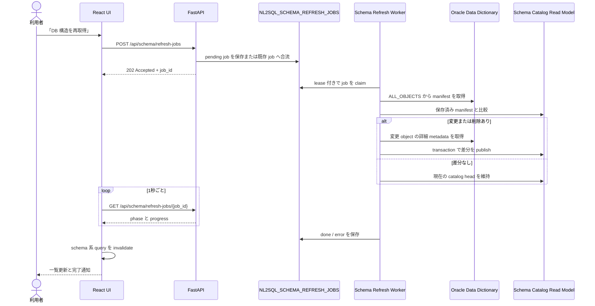

# Production Ready NL2SQLの「DB 構造を再取得」を支える差分同期と永続ジョブ設計

## はじめに

[Production Ready NL2SQL](https://github.com/engchina/no.1-production-ready-nl2sql) は、Oracle 26ai と OCI Enterprise AI を使った、本番運用を意識した NL2SQL の参照実装です。

このプロジェクトのテーブル管理、ビュー管理、SQL 生成などの画面には、次の二つの似た操作があります。

- **表示を更新**
- **DB 構造を再取得**

一見すると、どちらも一覧を読み直すだけに見えます。しかし、内部で行っていることは大きく異なります。

| 操作 | 読み取る対象 | 用途 | 長時間処理 |
|---|---|---|---|
| 表示を更新 | アプリケーションが保持する schema catalog の read model | 現在公開済みの一覧・詳細を再表示する | 行わない |
| DB 構造を再取得 | Oracle のデータディクショナリ | DDL やコメント変更を検出し、read model を更新する | 永続ジョブとして実行する |

「DB 構造を再取得」は、HTTP リクエスト内で `ALL_TAB_COLUMNS` を全走査する同期処理ではありません。ジョブ投入、差分検出、対象 metadata の取得、トランザクションによる公開、画面横断の進捗追跡までを含む機能です。

本稿では、この機能を題材に、長時間処理を本番向けに組み立てる際の設計ポイントをコードに沿って解説します。内容は `main` の commit [`82d972e`](https://github.com/engchina/no.1-production-ready-nl2sql/tree/82d972ecb5558a7420a2a597b9f9008dffad2e6f) 時点を基準にしています。

## schema catalog は何のためにあるのか

NL2SQL では、質問から SQL を生成する前に、利用可能な表、ビュー、列、制約、依存関係を把握する必要があります。毎回 Oracle のデータディクショナリへ直接問い合わせると、次の問題が生じます。

- 一覧画面を開くたびに重い metadata SQL が走る
- 大規模 schema ではレスポンスサイズと待ち時間が増える
- SQL 生成、Profile、Ontology など複数機能で同じ構造情報を繰り返し取得する
- DDL と読み取りが並行したとき、機能ごとに異なる時点の構造を参照しやすい

そこで本プロジェクトは、Oracle の schema metadata をアプリケーション用の read model に変換して保持します。主な永続化先は次のとおりです。

| DB object | 保持する内容 |
|---|---|
| `NL2SQL_SCHEMA_CATALOG_HEAD` | catalog version、fingerprint、件数、ETag、公開日時 |
| `NL2SQL_SCHEMA_OBJECTS` | 表・ビュー単位の軽量一覧情報と `LAST_DDL_AT` |
| `NL2SQL_SCHEMA_COLUMNS` | 列、型、nullable、コメント、サンプル値 |
| `NL2SQL_SCHEMA_CONSTRAINTS` | PK/FK などの制約情報 |
| `NL2SQL_SCHEMA_DEPENDENCIES` | ビューの参照関係 |
| `NL2SQL_SCHEMA_REFRESH_JOBS` | refresh job の状態、進捗、lease、heartbeat |

一覧 API は `NL2SQL_SCHEMA_OBJECTS` を keyset pagination で検索し、詳細 API は選択された owner/object の列と制約だけを展開します。「DB 構造を再取得」は、この read model を Oracle の最新構造へ追従させる処理です。

## 全体の処理フロー

手動で「DB 構造を再取得」を押した場合の流れは次のようになります。



重要なのは、最初の POST が処理完了を待たず、`202 Accepted` で即時に返ることです。Oracle metadata の取得は API process から分離できます。また、submit/status route は同期 repository I/O を扱う FastAPI の `def` route であり、ASGI event loop 上で python-oracledb の同期 I/O を直接実行しません。

## API 契約

API は [`backend/app/features/schema/router.py`](https://github.com/engchina/no.1-production-ready-nl2sql/blob/82d972ecb5558a7420a2a597b9f9008dffad2e6f/backend/app/features/schema/router.py) にまとまっています。

### ジョブを投入する

```http
POST /api/schema/refresh-jobs
```

成功時は HTTP 202 で `SchemaRefreshJob` を返します。認証済みセッションがある場合は、たとえば次のように開始できます。

```bash
curl -sS -X POST \
  -b cookie.txt \
  http://localhost:8000/api/schema/refresh-jobs | jq
```

レスポンス例です。

```json
{
  "data": {
    "job_id": "33f06559-5a2f-4b48-b6f4-225e224c27fa",
    "status": "pending",
    "mode": "full",
    "source": "manual",
    "target_objects": [],
    "requires_full_refresh": false,
    "created_at": "2026-08-31T03:00:00+00:00",
    "started_at": null,
    "finished_at": null,
    "worker_id": "",
    "heartbeat_at": null,
    "lease_expires_at": null,
    "attempt": 0,
    "phase": "queued",
    "processed_objects": 0,
    "total_objects": 0,
    "scanned_objects": 0,
    "changed_objects": 0,
    "deleted_objects": 0,
    "catalog_version": null,
    "error_code": ""
  }
}
```

### 実行中のジョブを再発見する

```http
GET /api/schema/refresh-jobs/active
```

`pending` または `running` の先頭ジョブを `active_job` として返します。ブラウザの再読込や別画面への移動後も、フロントエンドはこの API から追跡を再開できます。実行中ジョブがなければ `active_job` は `null` です。

### 個別ジョブを確認する

```http
GET /api/schema/refresh-jobs/{job_id}
```

ジョブの状態と phase は別の軸です。

| `status` | 意味 |
|---|---|
| `pending` | worker の取得待ち |
| `running` | worker が処理中 |
| `done` | 正常終了 |
| `error` | 失敗。`error_code` を確認する |

| `phase` | UI 表示 | 主な処理 |
|---|---|---|
| `queued` | 待機中 | ジョブ投入済み、未 claim |
| `scanning` | 変更確認中 | manifest の取得と比較 |
| `fetching` | 構造取得中 | 変更 object の詳細取得と merge |
| `persisting` | 保存中 | read model の transaction 更新 |
| `done` | 完了 | catalog 公開済み |

`total_objects` が確定するまでは、UI は無理に `0/0` を表示しません。値が確定した後だけ、たとえば「DB 構造再取得: 保存中 218/218」と表示します。

### 同期 API の削除

Schema refresh の同期 API は削除済みです。フロントエンドと外部クライアントは
`POST /api/schema/refresh-jobs` で job を投入し、`GET /api/schema/refresh-jobs/{job_id}` または
`GET /api/schema/refresh-jobs/active` で進捗を確認します。job 投入に失敗した場合も旧同期 API へ
fallback せず、固定エラー表示と手動再試行に委ねます。

## `LAST_DDL_TIME` を使った差分検出

実装の中心は [`Nl2SqlService._run_schema_refresh_job`](https://github.com/engchina/no.1-production-ready-nl2sql/blob/82d972ecb5558a7420a2a597b9f9008dffad2e6f/backend/app/features/nl2sql/service.py#L3318) です。

いきなり全列・全制約を取得するのではなく、最初に `ALL_OBJECTS` から軽量な manifest を作ります。

```sql
SELECT o.owner, o.object_name, o.last_ddl_time
FROM all_objects o
WHERE o.object_type IN ('TABLE', 'VIEW', 'MATERIALIZED VIEW')
  AND o.status = 'VALID'
ORDER BY o.owner, o.object_name
```

実際の SQL には owner と object name のフィルターも入ります。取得結果は概念的には次の map です。

```python
incoming_manifest = {
    ("APP", "ORDERS"): "2026-08-31T10:15:00",
    ("APP", "CUSTOMERS"): "2026-08-30T09:00:00",
}
```

保存済み manifest と比較し、詳細を再取得すべき object と、Oracle から消えた object を求めます。

```python
changed_keys = {
    key
    for key, last_ddl_at in incoming_manifest.items()
    if stored_manifest.get(key) != last_ddl_at
}

deleted_keys = set(stored_manifest) - set(incoming_manifest)
```

その後、`changed_keys` に入った object だけを [`fetch_catalog_objects`](https://github.com/engchina/no.1-production-ready-nl2sql/blob/82d972ecb5558a7420a2a597b9f9008dffad2e6f/backend/app/features/nl2sql/oracle_adapter.py#L749) で詳細取得します。Oracle の bind 数が過大にならないよう、対象は250件単位に分割されます。

この二段階方式には次の利点があります。

- 変更がない通常ケースでは `ALL_OBJECTS` の軽量 scan だけで終わる
- 1テーブルの ALTER のために全表の列・制約を取り直さない
- 削除された object も manifest の集合差で検出できる
- 差分がなければ新しい catalog version を発行せず、現在の head を維持できる

これは「行データの同期」ではなく「DB 構造と metadata の同期」です。そのため、アプリ内の mutation 分類では `CREATE`、`ALTER`、`DROP`、`COMMENT`、`ANNOTATION`、create/replace import が schema refresh の対象です。`INSERT`、`UPDATE`、`DELETE`、`MERGE`、既存表への append など、データだけを変更する処理は schema refresh job を作りません。

## full refresh と targeted refresh

`SchemaRefreshJob.mode` には `full` と `targeted` があります。

### full

利用者が「DB 構造を再取得」を明示的に押した場合は `full` です。許可された schema 全体の manifest を取得し、保存済み manifest と比較します。

### targeted

テーブル作成、ビュー削除、コメント変更など、アプリ自身が変更対象を特定できる場合は `targeted` です。たとえばテーブル作成後は、概念的に次の target を持つジョブを投入します。

```json
{
  "owner": "APP",
  "object_name": "ORDERS",
  "object_type": "table",
  "expected_state": "present"
}
```

削除後は `expected_state: "absent"` です。targeted refresh は、対象 object だけを `ALL_OBJECTS` と詳細 metadata から取得します。無関係な object は既存 read model に残します。

さらに、期待状態を安全確認に使います。

- `present` を期待した object が Oracle に存在しない
- `absent` を期待した object がまだ存在する
- SQL 解析などで対象 object を一意に特定できない

この場合、部分更新を推測で続けず、job を `error` にして `requires_full_refresh: true` を返します。代表的な安定 error code は次の二つです。

- `schema_refresh_full_required`
- `schema_refresh_target_unresolved`

UI は「DB 構造の差分同期で不整合を検出しました。DB 構造を再取得してください」と案内し、利用者が full refresh に切り替えられるようにします。

## Oracle から何を取得するのか

Oracle access は [`backend/app/features/nl2sql/oracle_adapter.py`](https://github.com/engchina/no.1-production-ready-nl2sql/blob/82d972ecb5558a7420a2a597b9f9008dffad2e6f/backend/app/features/nl2sql/oracle_adapter.py) に閉じ込められています。

詳細 catalog の主 query は、`ALL_TAB_COLUMNS` を中心に次の情報を結合します。

- `ALL_TABLES.NUM_ROWS`
- `ALL_OBJECTS.OBJECT_TYPE`
- `ALL_TAB_COMMENTS`
- `ALL_COL_COMMENTS`
- 制約と外部キー
- ビュー依存関係

対象 object type は `TABLE`、`VIEW`、`MATERIALIZED VIEW` です。また、NL2SQL の内部 table を利用者の業務 table として見せないために、次を除外します。

- `ALL_USERS.ORACLE_MAINTAINED = 'Y'` の owner
- owner/object name に `$` または `#` を含むもの
- `NL2SQL_%` で始まる内部 object
- `NL2SQL_SCHEMA_OWNER_ALLOWLIST` を設定した場合、その範囲外の owner

なお、一覧の行数は `COUNT(*)` ではなく `ALL_TABLES.NUM_ROWS`、つまり optimizer statistics の値です。正確な件数が必要なときだけ、UI の明示操作で `COUNT(*)` を実行します。

列の代表サンプル値も全量 refresh では読みません。refresh 時は `include_samples=False` とし、object 詳細を開いたときや Profile で必要になったときに遅延取得します。構造同期とデータ scan を分離することで、大規模表が refresh の待ち時間へ影響しにくくなります。

## read model を壊さずに公開する

Oracle 用 repository の [`apply_schema_refresh`](https://github.com/engchina/no.1-production-ready-nl2sql/blob/82d972ecb5558a7420a2a597b9f9008dffad2e6f/backend/app/features/nl2sql/incremental_store.py#L1397) は、一つの transaction で次を実行します。

1. `NL2SQL_SCHEMA_CATALOG_HEAD` の現在 version を `FOR UPDATE` で取得する
2. changed/deleted object の列、制約、object 行を削除する
3. changed object の最新 metadata を挿入する
4. merge 済み catalog を基に依存関係を再構築する
5. 件数、fingerprint、ETag、次の catalog version を head に保存する
6. schema namespace の change token を進めて commit する

途中で例外が起きれば rollback します。metadata 取得中の失敗も publish 前なので、既存 catalog は残ります。つまり「一部の表だけ新しく、残りは壊れている」という中間状態を利用者へ公開しません。

公開後は process-local schema cache を clear します。別 process は change token の変化を検出して cache を更新します。`GET /api/schema/catalog/head`、object 一覧、object 詳細は catalog version に結び付いた ETag を返すため、未変更なら `304 Not Modified` にできます。

また、通常の一覧・詳細 read path は schema refresh 用の process lock を取得しません。worker が構造を取得している間も、利用者は公開済みの旧 catalog を読み続けられます。read model の更新 transaction が commit された時点で、新しい version に切り替わります。

## 永続ジョブ、coalescing、lease

ジョブの公開型は [`SchemaRefreshJob`](https://github.com/engchina/no.1-production-ready-nl2sql/blob/82d972ecb5558a7420a2a597b9f9008dffad2e6f/backend/app/features/nl2sql/models.py#L383)、Oracle 永続化は [`incremental_store.py`](https://github.com/engchina/no.1-production-ready-nl2sql/blob/82d972ecb5558a7420a2a597b9f9008dffad2e6f/backend/app/features/nl2sql/incremental_store.py#L1494) にあります。

### 同時投入を一つへまとめる

複数画面や複数 API process から同時に refresh が要求されても、同じ schema に対する job を際限なく作りません。

Oracle repository は submit 時に `NL2SQL_SCHEMA_REFRESH_JOBS` を排他ロックし、`pending/running` job を確認します。

- 既に full の pending job があれば、その job を返す
- targeted の pending 中に full が来れば、既存 job を full へ昇格する
- targeted 同士であれば、owner/object の target を重複排除して merge する
- running job があれば、新しい並行 job を増やさず active job を返す

これにより、ボタンの連打や複数画面からの要求を backpressure として吸収します。

### worker の二重実行を防ぐ

worker は次のような SQL で、処理可能な job を一件だけ claim します。

```sql
SELECT JOB_ID, PAYLOAD_JSON
FROM NL2SQL_SCHEMA_REFRESH_JOBS
WHERE STATUS = 'pending'
   OR (STATUS = 'running' AND LEASE_EXPIRES_AT <= SYSTIMESTAMP)
ORDER BY CREATED_AT, JOB_ID
FETCH FIRST 1 ROWS ONLY
FOR UPDATE SKIP LOCKED
```

claim 後は `worker_id`、`heartbeat_at`、`lease_expires_at`、`attempt` を保存します。長い phase の境界で heartbeat と lease を更新します。

worker process が途中で停止しても、job は消えません。lease が切れた `running` job だけを別 worker が再 claim できます。まだ lease が有効な job は取得しないため、正常に動いている worker の処理を奪いません。同一 process 内では、さらに非 blocking lock で二重実行を防いでいます。

### ローカルと本番の実行方式

| 環境 | 設定 | 実行方式 |
|---|---|---|
| ローカル直接実行 | `NL2SQL_SCHEMA_REFRESH_WORKER_MODE=inprocess` | API process 内の daemon thread が job を処理 |
| Docker Compose / 本番 | `NL2SQL_SCHEMA_REFRESH_WORKER_MODE=external` | 独立した `schema-refresh-worker` service が処理 |

外部 worker の entry point は [`backend/app/cli/nl2sql_schema_refresh_worker.py`](https://github.com/engchina/no.1-production-ready-nl2sql/blob/82d972ecb5558a7420a2a597b9f9008dffad2e6f/backend/app/cli/nl2sql_schema_refresh_worker.py) です。

```bash
python -m app.cli.nl2sql_schema_refresh_worker --poll-seconds 1
```

Docker Compose では API 側を `external` にし、[`schema-refresh-worker`](https://github.com/engchina/no.1-production-ready-nl2sql/blob/82d972ecb5558a7420a2a597b9f9008dffad2e6f/docker-compose.yml#L42) を別 service として起動します。API の replica 数と metadata worker の replica 数を独立して調整できる構成です。

## React 側では一つの Coordinator が追跡する

フロントエンドの中心は [`SchemaRefreshCoordinator.tsx`](https://github.com/engchina/no.1-production-ready-nl2sql/blob/82d972ecb5558a7420a2a597b9f9008dffad2e6f/frontend/src/features/nl2sql/SchemaRefreshCoordinator.tsx) です。認証済みアプリケーションの共通 layout 内に置かれ、各画面は同じ context を参照します。

Coordinator は次を一元管理します。

- `start()` でジョブを投入する
- mutation response に含まれる既存 `schema_refresh_job_id` を `track()` する
- `GET /refresh-jobs/{job_id}` を1秒間隔で polling する
- mount、network reconnect、window focus 時に `/refresh-jobs/active` を再取得する
- 完了時に `schema` と `nl2sql/db-admin` の TanStack Query cache を invalidate する
- 同じ `job_id:status` の完了通知を一度だけ表示する
- 失敗は消えやすい toast ではなく、各画面の固定 Banner/FormStatus に残す

ジョブ状態から日本語 UI 表示への変換は [`schemaRefreshPresentation.ts`](https://github.com/engchina/no.1-production-ready-nl2sql/blob/82d972ecb5558a7420a2a597b9f9008dffad2e6f/frontend/src/features/nl2sql/schemaRefreshPresentation.ts) に集約されています。full は「DB 構造再取得」、targeted は「DB 構造差分同期」と区別されます。

共通 Coordinator によって、実行中状態は次の10ルートで共有されます。

1. SQL 生成
2. テーブル管理
3. ビュー管理
4. データ管理
5. サンプルデータ
6. コメント管理
7. アノテーション管理
8. 管理 SQL
9. Profile 管理
10. Ontology 構築

ある画面で refresh を開始して別画面へ移動しても、同じ進捗が header と作業領域に表示されます。ブラウザを再読込しても active job を再発見します。実行中は refresh action を disabled にし、30秒を超えた場合も追跡を打ち切らず、「通常より時間がかかっています」と経過時間を表示します。

## RBAC

権限定義は [`backend/app/security/permissions.py`](https://github.com/engchina/no.1-production-ready-nl2sql/blob/82d972ecb5558a7420a2a597b9f9008dffad2e6f/backend/app/security/permissions.py) にあります。

| permission | 許可される操作 |
|---|---|
| `nl2sql.schema.read` | catalog、object、job status、active job の参照 |
| `nl2sql.schema.refresh` | refresh job の投入。`schema.read` も内包する |

`GET /refresh-jobs/active` と個別 status は read 権限で参照できますが、`POST /refresh-jobs` には refresh 権限が必要です。進捗を見る権限と Oracle metadata の再取得を開始する権限を分けています。

## 観測性

[`incremental_observability.py`](https://github.com/engchina/no.1-production-ready-nl2sql/blob/82d972ecb5558a7420a2a597b9f9008dffad2e6f/backend/app/features/nl2sql/incremental_observability.py) は、低 cardinality の Prometheus metrics を公開します。

| metric | 観測対象 |
|---|---|
| `nl2sql_schema_refresh_changed_objects` | refresh ごとの変更 object 数 |
| `nl2sql_schema_refresh_duration_seconds` | `done/error` 別の全体時間 |
| `nl2sql_schema_refresh_pending_age_seconds` | 最古 pending job の待ち時間 |
| `nl2sql_schema_refresh_phase_duration_seconds` | scanning/fetching/persisting 別の時間 |
| `nl2sql_schema_refresh_errors_total` | 安定 `error_code` 別の失敗数 |

構造化ログには `schema_refresh_job_submitted`、`schema_refresh_job_completed`、`schema_refresh_job_requires_full_refresh`、`schema_refresh_job_failed` といった event を出し、`job_id`、mode、source、catalog version、changed/deleted count を相関できます。

監視では、単なる error 件数だけでなく、次の兆候を見ると有効です。

- pending age が継続的に増えていないか
- scanning と fetching のどちらが遅いか
- `schema_refresh_full_required` が急増していないか
- 変更 object 数に対して fetching 時間が比例しているか
- worker 再起動後に `attempt` が増えた job が完了しているか

## テストで保証していること

この機能はバックエンドの repository/service test、フロントエンドのロジック test、Playwright E2E で検証されています。

代表的なケースは次のとおりです。

- 同時 submit が同じ pending job へ合流する
- targeted 同士の target merge、targeted から full への昇格
- 変更 object だけを詳細取得し、削除 object を read model から除く
- targeted refresh が対象外 object を変更しない
- `present/absent` の不一致時に旧 catalog を維持して full refresh を要求する
- metadata 取得失敗時に旧 catalog version を維持する
- 有効 lease の job は奪わず、期限切れだけを再 claim する
- refresh lock を保持中でも一覧・詳細 read が待たされない
- 1秒 polling、長時間処理、途中の一時的な通信失敗から回復する
- 全10ルートと browser reload 後に進捗を復元する
- 完了 toast と query invalidation が重複しない

バックエンドの主要ケースは [`backend/tests/test_nl2sql_incremental_state.py`](https://github.com/engchina/no.1-production-ready-nl2sql/blob/82d972ecb5558a7420a2a597b9f9008dffad2e6f/backend/tests/test_nl2sql_incremental_state.py)、表示契約は [`frontend/tests/schema-refresh-job.test.ts`](https://github.com/engchina/no.1-production-ready-nl2sql/blob/82d972ecb5558a7420a2a597b9f9008dffad2e6f/frontend/tests/schema-refresh-job.test.ts)、画面横断の復元は [`frontend/tests/e2e/nl2sql-workflows.spec.ts`](https://github.com/engchina/no.1-production-ready-nl2sql/blob/82d972ecb5558a7420a2a597b9f9008dffad2e6f/frontend/tests/e2e/nl2sql-workflows.spec.ts) で確認できます。

## 運用前のチェックポイント

本番でこの機能を使う前に、少なくとも次を確認します。

1. incremental schema 用 migration が適用されている
2. `NL2SQL_RUNTIME_MODE=oracle` で Oracle 接続が構成されている
3. `NL2SQL_PERSISTENCE_MODE=oracle` でジョブと read model が永続化される
4. API を `external` mode にした場合、`schema-refresh-worker` が起動している
5. `NL2SQL_SCHEMA_REFRESH_LEASE_SECONDS` が最大想定処理時間に対して短すぎない
6. `NL2SQL_SCHEMA_OWNER_ALLOWLIST` が必要な業務 schema を含んでいる
7. `nl2sql.schema.refresh` を必要な管理ロールだけに付与している
8. pending age、phase duration、error code を監視している

特に、API だけを external mode で起動し、worker を起動し忘れると job は `pending` のままです。`nl2sql_schema_refresh_pending_age_seconds` は、この構成ミスを早く見つける指標になります。

## まとめ

Production Ready NL2SQL の「DB 構造を再取得」は、単なる reload button ではありません。

- 軽量 manifest で変更を検出する
- changed/deleted object だけを反映する
- DDL 後は targeted、手動復旧は full と使い分ける
- 永続ジョブ、coalescing、lease で多重実行と worker 障害に備える
- transaction と versioned read model で失敗時も旧 catalog を提供する
- React の共通 Coordinator で画面遷移や再読込をまたいで追跡する
- RBAC、metrics、構造化ログ、E2E test まで含めて運用可能にする

長時間の metadata 同期を本番機能として提供するには、「取得 SQL」だけでなく、投入、差分、公開、復旧、可視化、権限、観測までを一つの処理として設計する必要があります。この実装は、その具体例として参考にできる構成です。
